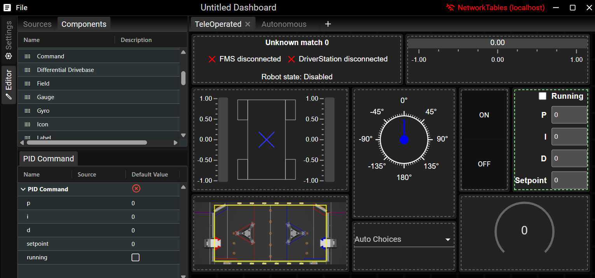

# FRC Web Components

FRC Web Components (FWC) is a web-based dashboard used for the [FIRST Robotics Competition (FRC)](https://www.firstinspires.org/robotics/frc).



FWC can be either installed as a standalone application, or as a javascript package for custom dashboard solutions.

## Installation

The standalone Tauri application that wraps around FWC can be installed here: [https://github.com/frc-web-components/app/releases](https://github.com/frc-web-components/app/releases)

To install using npm:

```bash
npm i @frc-web-components/fwc@latest
```

## Try it out!

A live version of the application can be viewed here: [https://frc-web-components.github.io/dashboard/](https://frc-web-components.github.io/dashboard/)

## Documentation

- [Component documentation](https://frc-web-components.github.io/storybook) - Component examples and documentation
- [Dashboard Interface](/docs/dashboard.md) - Learn how to use the FWC dashboard app
- [Plugin Development](/docs/plugins.md) - Documentation on FWC dashboard plugin development.
- [Lit plugin example](/examples/lit-plugin/README.md) - An example plugin using the lit-plugin template from the `create-fwc` cli tool.
- [React plugin example](/examples/react-plugin/README.md) - An example plugin using the react-plugin template from the `create-fwc` cli tool.
- [Svelte plugin example](/examples/svelte-plugin/README.md) - An example plugin using the svelte-plugin template from the `create-fwc` cli tool.
- [React custom dashboard example](/examples/react-custom-dashboard/README.md) - An example custom dashboard using the react-custom-dashboard template from the `create-fwc` cli tool.
- [Svelte custom dashboard example](/examples/svelte-custom-dashboard/README.md) - An example custom dashboard using the svelte-custom-dashboard template from the `create-fwc` cli tool.

## Developing

### Installing

This project uses the pnpm package manager. Please install pnpm first before proceeding: https://pnpm.io/installation

If using vscode the following extensions are recommended:

- [Prettier](https://marketplace.visualstudio.com/items?itemName=esbenp.prettier-vscode): Code formatting
- [CSS Modules](https://marketplace.visualstudio.com/items?itemName=clinyong.vscode-css-modules): Used for autocompleting css modules

To install run in the root directory:
https://github.com/frc-web-components/react-dashboard.gitk

```bash
pnpm install
```

### Running

To run the project locally run in the root directory:

```bash
pnpm dev
```

### Publishing and Releasing

This project uses changesets to manage publishing. More info can be found here: https://pnpm.io/using-changesets
