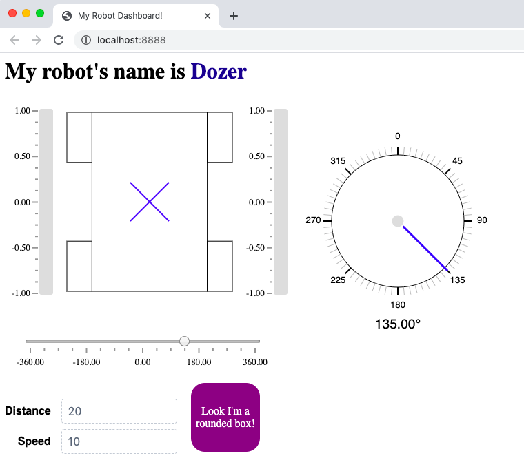

FRC Web Components
==================

A set of web components to build custom dashboards for the `FIRST Robotics Competition (FRC) <https://www.firstinspires.org/robotics/frc>`_. 

FRC Web Components works with `pynetworktables2js <https://github.com/robotpy/pynetworktables2js>`_ to communicate with your robot over NetworkTables. To use, run **pynetworktables2js** where you're serving your HTML files, include the **frc-web-components.js** file as a script in your HTML page, and wrap your HTML in a``<frc-dashboard></frc-dashboard>`` tag, and you're ready to go!

.. code:: html

  <html>
    <head></head>
    <body>
      <frc-dashboard>
        <nt-number key="/angle" value="135"></nt-number>
        <nt-string key="/robotName" value="Dozer"></nt-string>
        <nt-boolean key="/box/value" value="true"></nt-boolean>
        <nt-string key="/box/trueColor" value="purple"></nt-string>

        <h1>
          My robot's name is <frc-label source-key="/robotName"></frc-label>
        </h1>

        <frc-differential-drivebase 
          source-key="/LiveWindow/Ungrouped/DifferentialDrive[1]"
        ></frc-differential-drivebase>

        <frc-gyro source-key="/angle" precision="2"></frc-gyro>
        <frc-number-slider 
          source-key="/angle"
          min="-360"
          max="360"
        ></frc-number-slider>

        <frc-encoder speed="10" distance="20"></frc-encoder>

        <frc-boolean-box class="rounded-box" source-key="/box">
          Look I'm a rounded box!
        </frc-boolean-box>
      </frc-dashboard>
    </body>
  </html>

