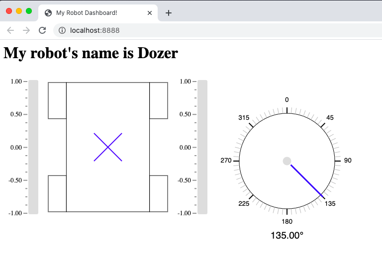
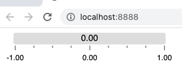
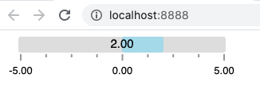
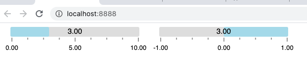
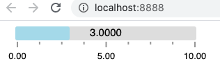
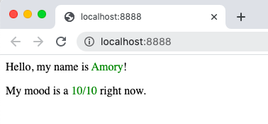

FRC Web Components
==================

A set of web components to build custom dashboards for the `FIRST Robotics Competition (FRC) <https://www.firstinspires.org/robotics/frc>`_. 

FRC Web Components works with `pynetworktables2js <https://github.com/robotpy/pynetworktables2js>`_ to communicate with your robot over NetworkTables. To use, run **pynetworktables2js** where you're serving your HTML files, include the **frc-web-components.js** file as a script in your HTML page, and wrap your HTML in a **frc-dashboard** tag, and you're ready to go!

.. code:: html

  <html>
    <head>
      <title>My Robot Dashboard!</title>
    </head>
    <body>
      <frc-dashboard>
        <nt-string key="/robotName" value="Dozer"></nt-string>
        <nt-number key="/angle" value="135"></nt-number>
        <h1>
          My robot's name is <frc-label source-key="/robotName"></frc-label>
        </h1>
        <frc-differential-drivebase 
          source-key="/LiveWindow/Ungrouped/DifferentialDrive[1]"
        ></frc-differential-drivebase>
        <frc-gyro source-key="/angle" precision="2"></frc-gyro>
      </frc-dashboard>
      
    </body>
  </html>

Installation
============

- Install `pynetworktables2js <https://github.com/robotpy/pynetworktables2js>`_
- Download the **frc-web-components.js** file from the `releases <https://github.com/frc-web-components/frc-web-components/releases>`_ page and include it in your HTML dashboard.

Examples
========

Usage examples can be found `here <https://frc-web-components.github.io/>`_.

How to Use
==========

To use wrap your HTML dashboard code in the **<frc-dashboard></frc-dashboard>** element. This will include the necessary code for your dashboard to run as well as asynchronously load the **pynetworktables2js** script in your page.

Using the NetworkTables API
----------------------------

Since the script is loaded asynchronously, you'll need to use the **frc-dashboard**'s *onload* event.

.. code:: html

  <html>
    <body>
      <frc-dashboard onload="ntLoaded()">
        <!-- Dashboard code goes here -->
      </frc-dashboard>
      
      
    </body>
  </html>
  
More on the NetworkTables API can be found here: https://robotpy.readthedocs.io/projects/pynetworktables2js/en/stable/api_js.html

Using the components
--------------------

FRC Web Components are used by adding them inside the **<frc-dashboard></frc-dashboard>** component:

.. code:: html

  <frc-dashboard onload="ntLoaded()">
    <frc-number-bar></frc-number-bar>
  </frc-dashboard
  

  
They can be changed by setting their attributes:

.. code:: html

  <frc-dashboard onload="ntLoaded()">
    <frc-number-bar value="2" min="-5" max="5"></frc-number-bar>
  </frc-dashboard
  

  
You can also set a component's attributes by giving it a NetworkTable key:

.. code:: html

  <frc-dashboard onload="ntLoaded()">
    <nt-number key="/bar/value" value="3"></nt-number>
    <nt-number key="/bar/min" value="0"></nt-number>
    <nt-number key="/bar/max" value="10"></nt-number>
    <!-- Here we pass the subtable "/bar" -->
    <frc-number-bar source-key="/bar"></frc-number-bar>
    <!-- Here we pass the single NetworkTable entry "/bar/value" -->
    <frc-number-bar source-key="/bar/value"></frc-number-bar>
  </frc-dashboard>
  

  
Above we passed NetworkTable keys into two separate **<frc-number-bar>** components through the **source-key** attribute. If we pass in a subtable, all the subtable's entries will be mapped to the component's attributes. If we pass in a single entry, the component's primary attribute will be set, if it has one. In this case **<frc-number-bar>**'s primary attribute is **value**.

You can also set a component's attributes through a mixture of NetworkTables and manually setting its attributes:

.. code:: html

  <frc-dashboard onload="ntLoaded()">
    <nt-number key="/bar/value" value="3"></nt-number>
    <nt-number key="/bar/min" value="0"></nt-number>
    <nt-number key="/bar/max" value="10"></nt-number>
   
    <frc-number-bar source-key="/bar" min="-5" precision="4"></frc-number-bar>
  </frc-dashboard>
  

Above you may notice the component's min attribute took on the value passed in through NetworkTables. NetworkTables takes precedence and will override hard coded attribute values.

Also note that NetworkTable keys will always be converted to camelCase to match the attribute's properties. For example:

.. code:: html

  <frc-dashboard onload="ntLoaded()">
    <nt-number key="/bar/.value" value="3"></nt-number>
    <nt-number key="/bar/Min" value="0"></nt-number>
    <nt-number key="/bar/ max " value="10"></nt-number>
   
    <frc-number-bar source-key="/bar" min="-5" precision="4"></frc-number-bar>
  </frc-dashboard>
  
Will still display correctly:
  

Because of this conversion it's possible for name collisions to happen.

.. code:: html

  <nt-number key="/bar/.value" value="-1"></nt-number>
  <nt-number key="/bar/Value" value="-.5"></nt-number>
  <nt-number key="/bar/value" value="0"></nt-number>
  <nt-number key="/bar/ value" value=".5"></nt-number>
  
  <frc-number-bar source-key="/bar/value"></frc-number-bar>
  
All of these will result in the same attribute being set. The attribute's value will be .5 since that was the last line executed.

Creating Your Own Component
===========================

The list of FRC Web Components will continue being updated and expanded, but many teams will probably want to create their own for their custom dashboards. The **frc-web-components.js** file exposes a couple of modules for creating and registering components: **webbit** and **webbitRegistry**. The **webbit** module is used to define components and **webbitRegistry** is used to register them. Both these modules contain a number helper functions and classes used to create custom components, but these are the most commonly used ones:

.. code:: javascript

  // These are the functions you need to define your component
  var { Webbit, css, html } = webbit;
  
  class MyComponentClass extends Webbit {
  
    // This is the function needed to define properties, which automatically 
    // update the component when their values change. They also by default 
    // reflect their values in your component's attributes. That means when 
    // you change the name attribute in your component's HTML element, 
    // this.name will also change, and when you change this.name internally, 
    // the name attribute in your component's HTML element will also change.
    static get properties() {
      return {
        name: { type: String, primary: true },
        moodRating: { type: Number, attribute: 'mood-rating' }
      }
    }
    
    // This is the function needed to define the styles for your component.
    // The css here only affects the HTML rendered in your component. CSS
    // defined outside your component also doesn't affect your component's
    // rendered HTML.
    static get styles() {
      return css`
        p span {
          color: green;
        }
      `;
    }
    
    // This is needed to initialize things in your component and set default
    // property values.
    constructor() {
      super();
      this.name = 'Bob';
      this.moodRating = 8.5;
    }
    
    // This is the function needed to define the HTML your component renders
    render() {
      return html`
        
Hello, my name is ${this.name}!

        
My mood is a ${this.moodRating}/10 right now.

      `;
    }
  }
  
  // This is the function you need to register your component
  webbitRegistry.define('my-component', MyComponentClass);
  
Create a file called **my-component.js** in the same folder as your **index.html** and **frc-web-components.js**, and add the above code to the file. Include the script below where you included the **frc-web-components.js** script in your **index.html** file:

.. code:: html

  <html>
    <body>
      <frc-dashboard>
        <my-component name="Amory" mood="10"></my-component>
      </frc-dashboard>
      
      
    </body>
  </html>
  
Your webpage should now look like this:

You can also now connect your component to NetworkTables:

.. code:: html

  <html>
    <body>
      <frc-dashboard>
        <nt-string key="/myComponent/name" value="Amory"></nt-string>
        <nt-number key="/myComponent/moodRating" value="10"></nt-number>
        <my-component source-key="/myComponent"></my-component>
      </frc-dashboard>
      
      
    </body>
  </html>
  
Your webpage should look the same:

LitElement
----------

The **Webbit** class itself extends **LitElement**, which is a library used to create custom components. There are some differences and gotchas, but if you know how to create components using **LitElement**, you know almost everything you need to create custom FRC components. To understand how **LitElement** works, look over the project's live examples, guide and API here: https://lit-element.polymer-project.org/

Creating components examples and tutorials
------------------------------------------

More in-depth tutorials on how to create your own components will be added soon. You can also look at the source code for the existing list of components if you need help getting started: https://github.com/frc-web-components/frc-web-components/tree/master/src/components
