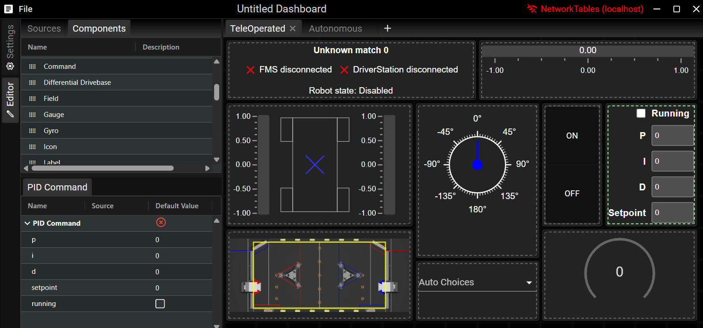

FRC Web Components
==================

FRC Web Components (FWC) is a web-based dashboard used for the `FIRST Robotics Competition (FRC) <https://www.firstinspires.org/robotics/frc>`_.

FWC can be either installed as a standalone application, or as a javascript package for custom dashboard solutions.

Installation
============

The standalone Tauri application that wraps around FWC can be installed here: https://github.com/frc-web-components/app/releases

To install using npm:

.. code:: bash

  $ npm i @frc-web-components/frc-web-components

FWC can also be installed as a script and included directly into an HTML page. Script can be downloaded from the the `releases <https://github.com/frc-web-components/frc-web-components/releases>`_ page.

Try it out!
===========

A live version of the application be viewed here: https://frc-web-components.github.io/dashboard/

Documentation
=============

- `Plugin Development </docs/plugins.rst>`_