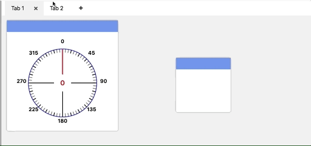
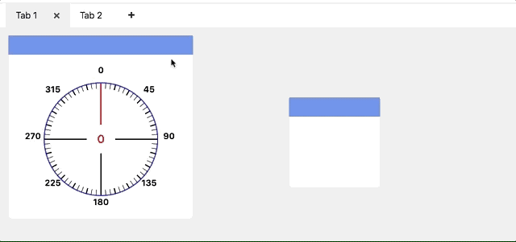
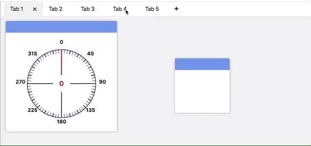
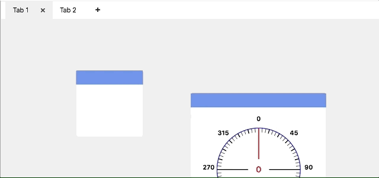

Creating and Manipulating Tabs
==============================

Tabs are used to separate widgets that are used for different purposes. You might have a tab the has the display for helping debug the robot program and a different tab for use in competitions.

Switching between tabs
----------------------

You can switch between tabs by clicking on them.

Adding tabs
-----------

You can add tabs by clicking the plus button to the right of the tabs.

Removing tabs
-------------

You can remove a tab by selecting it and clicking the x button that appears to the right of the tab.

Renaming tabs
-------------

You can rename a tab by clicking its label and manipulating the text input field inside of it.