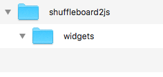
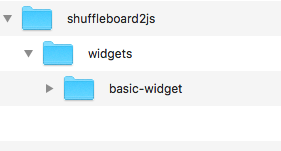
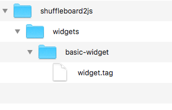
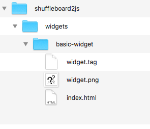
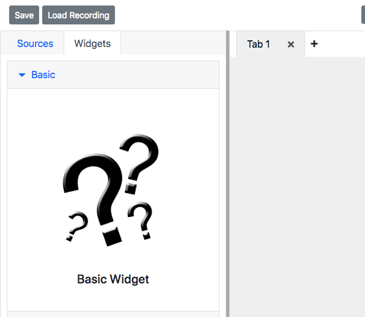
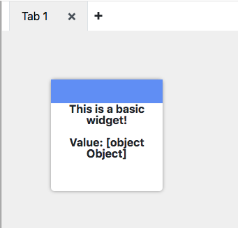
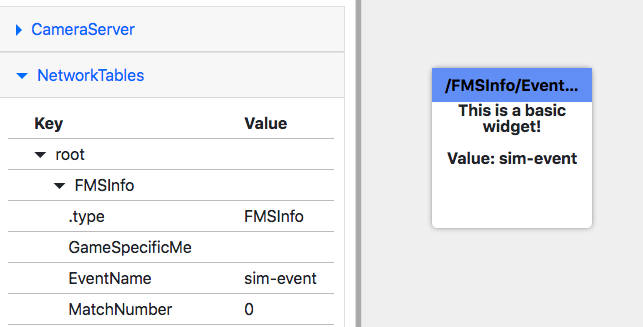

Creating a Basic widget
=======================

Choosing a unique ID
--------------------

Every shuffleboard2js widget requires a unique ID. Valid IDs can contain lowercase letters, numbers and dashes. Your ID should be related to what your widget does.

Examples of valid IDs: ``basicwidget``, ``basic-widget2``

Examples of invalid IDs: ``BASICWIDGET``, ``basic-widget?!``

Folder structure
----------------

In the folder you ran *shuffleboard2js*, you should have a folder structure that looks like this:

Custom widgets need their own folder inside the *shuffleboard2js/widgets* folder. Create a folder named after the ID you chose inside the *shuffleboard2js/widgets* folder. In this example we'll use *basic-widget* as the widget ID:

widget.tag
----------

The code for your custom widget goes in a file called ``widget.tag``. This file has a special HTML like syntax which you'll learn more about in the :ref:`Widget Anatomy <widget-anatomy>` section.

For now create a ``widget.tag`` file in the *shuffleboard2js/widgets/basic-widget* folder and add the following code to it:

.. code:: html

   <basic-widget>
     
This is a basic widget!

     
Value: {opts.table}

   </basic-widget>

Your folder structure should now look like this:

Registering your widget
-----------------------

Your widget doesn't show up automatically in the *shuffleboard2js* interface. To register your widget you need to add an ``index.html`` file with the following code:

.. code:: html

  <!-- This includes widget.tag into this file -->
  

  

You can optionally put an image in your widget's folder named after whatever you passed into the *image* configuration property passed into the *dashboard.registerWidget* function.

Your folder structure should now look like this:

Refresh the interface and your widget should be there:

Dragging a widget onto the interface should look like this:

Drag a NetworkTables source onto the widget of type *string*. The widget should take on the NetworkTable value:

