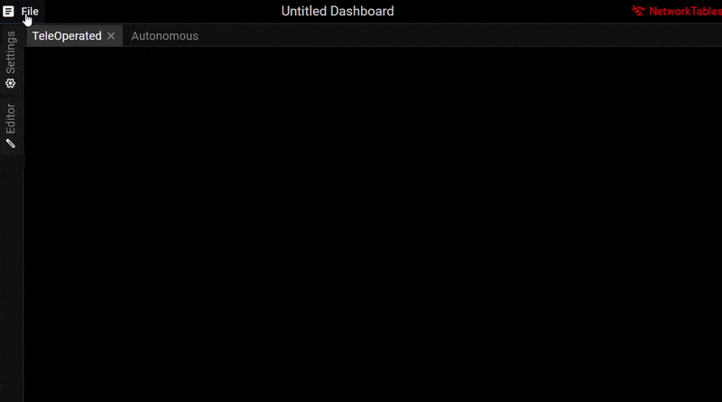

# Dashboard

[<- Home](/README.md)

- [Layout](#layout)
- [Adding, Selecting, and Removing Elements](#adding-selecting-and-removing-elements)
- [Tab Management](#tab-management)
- [Moving and Resizing Components](#moving-and-resizing-components)
- [Setting Element Properties](#setting-element-properties)
- [Property Sources and Robot Communication](#property-sources-and-robot-communication)
- [Source Providers](#source-providers)
- [Themes](#themes)
- [Saving and Opening Dashboards](#saving-and-opening-dashboards)
- [Importing Plugins](#importing-plugins)

## Layout

When you first open the app, you will see the following panels:

## Adding, Selecting, and Removing Elements

Elements can be added to the dashboard by dragging them from the `Components` tabl on the sidebar to the dashboard:

To select an element, click on it in the dashboard. Its properties will appear in the `Properties` panel in the sidebar.

To delete a component, either press Delete on your keyboard, right click on the component and select "Remove", or click the red `X` in its `Properties` panel.

## Tab Management

By default, each dashboard starts with a TeleOperated tab and an Autonomous tab. If you need more tabs, you can add them with the `+` button. You can remove tabs by clicking the `x` button on the tab handle. You can rename a tab by double-clicking on the tab handle.

## Moving and Resizing Components

Selected elements can be moved by dragging them around their center:

Elements can be resized by dragging their upper left and lower right corners:

## Setting Element Properties

Element behavior changes based on their properties. A selected element's property values can be set in the Properties view. Property values can be changed through their input fields:

## Property Sources and Robot Communication

You can connect to your robot or robot simulation from the Dashboard Settings panel:

Use `localhost` to connect to your simulated robot or your team # or robot IP address to connnect to your robot.

Component properties can be controlled externally through sources such as NetworkTables. A component connected to NetworkTables can send to or receive updates from a physical or simulated robot.

Below the slider component is bound to the `/num` topic in NetworkTables. The slider and value in OutlineViewer update when changed on either end:

NetworkTable topics can be bound to components by dragging them from the `Sources` panel to the selected component's `Properties` panel:

Sources with sub-topics can also be bound to components. Sub-topics will be mapped to properties. Topic names will be converted to camel-case so they don't have to align with property names perfectly:

Sources can also be bound to individual properties:

## Source Providers

TODO

## Themes

Themes can be changed in the settings menu. The available themes are "dark" and "light":

## Saving and Opening Dashboards

Dashboards can be saved and reopened through the file menu:

## Importing Plugins

To import the plugin open the app and click the `File > Plugins` menu item:

This should open the plugins dialog:

Click `Load Plugin` which open up an open folder dialog. Navigate to your plugin and select the `plugin` folder generated with the `npm run build` command:

You should now see the plugin loaded in the dialog:

The app must be refreshed to view the changes:

The plugin should now be successfully loaded.
