Dashboard
=========

`<- Back </README.rst>`_

- `Adding, Selecting and Removing Elements <#adding-selecting-and-removing-elements>`_
- `Adding and Removing Tabs <#adding-and-removing-tabs>`_
- `Moving and Resizing Elements <#moving-and-resizing-elements>`_
- `Setting Element Properties <#setting-element-properties>`_
- `Property Sources and Robot Communication <#property-sources-and-robot-communication>`_
- `Source Providers <#source-providers>`_
- `Themes <#themes>`_
- `Saving and Opening Dashboards <#saving-and-opening-dashboards>`_
- `Importing Plugins <#importing-plugins>`_

Adding, Selecting and Removing Elements
=============================

Elements can be added to the dashboard by dragging them from the sidebar to the dashboard:

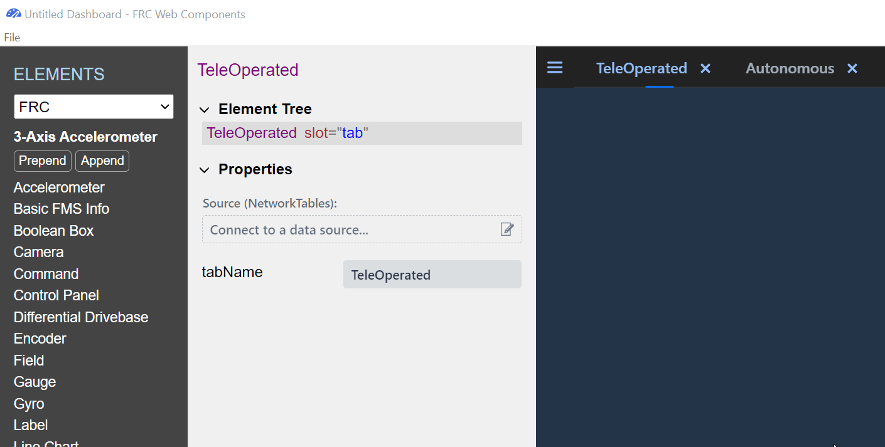

Elements can also be added by clicking on the **append** or **prepend** button:

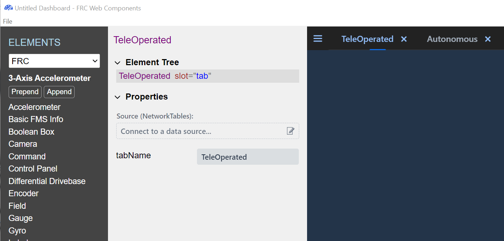

Elements are grouped into categories. Other categories can be selected from the dropdown at the top of the sidebar:

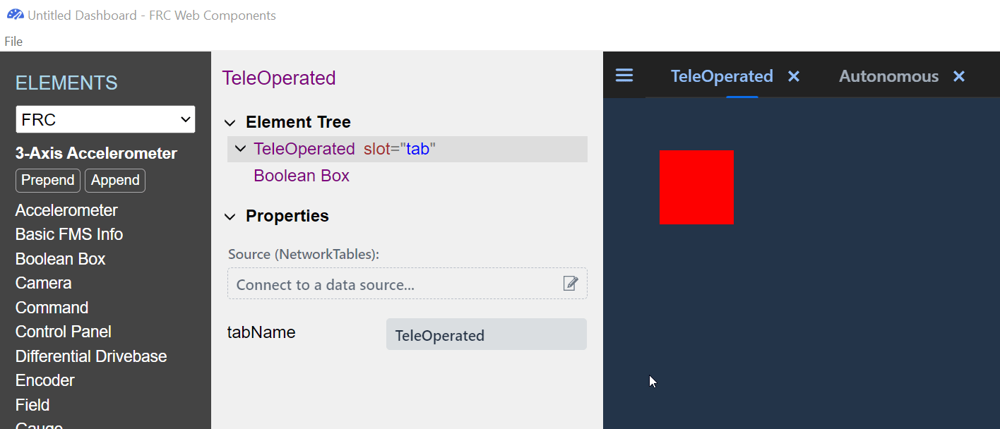

The available elements to add depends on the element currently selected. For example, the **Chart Axis** and **Chart Data** are the only elements that can be added to a **Line Chart**:

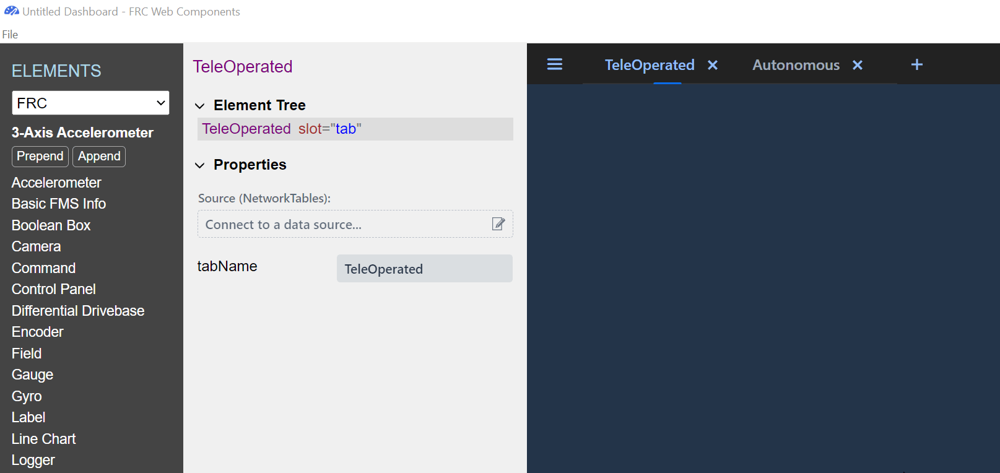

Elements can be selected by clicking on them:

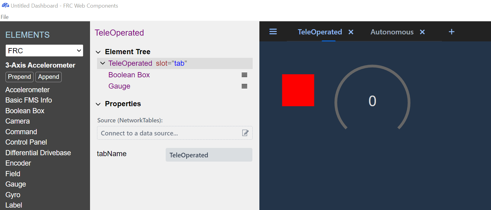

Most selected elements have a green dashed border, although some do not. Selected dashboard tabs don't, and neither do elements that have no size. Line Chart data and axis elements have no size and can't be selected by clicking on them.

All Elements including sizeless ones like **Chart Data**, can alternatively be selected in the element tree by clicking on them:

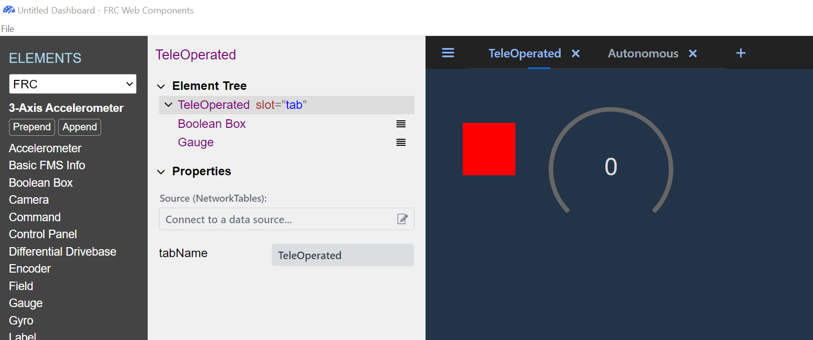

Most elements can be removed by pressing the delete/backspace key.

Adding and Removing Tabs
========================

Tabs can be added with the **+** button and removed with the **x** button. They can also be renamed using the **tabName** property in the **Properties** view:

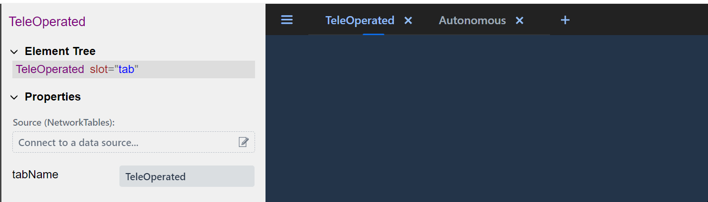

Moving and Resizing Elements
============================

Selected elements can be moved by dragging them around their center:

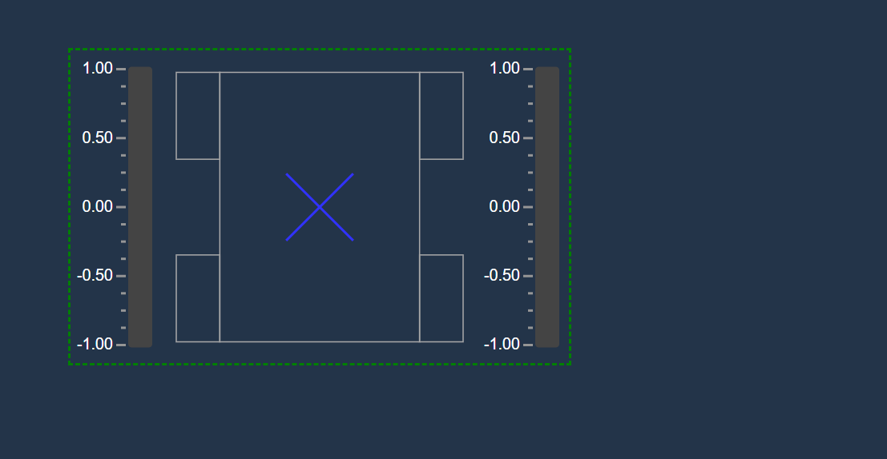

Elements can be resized by dragging their edges and corners:

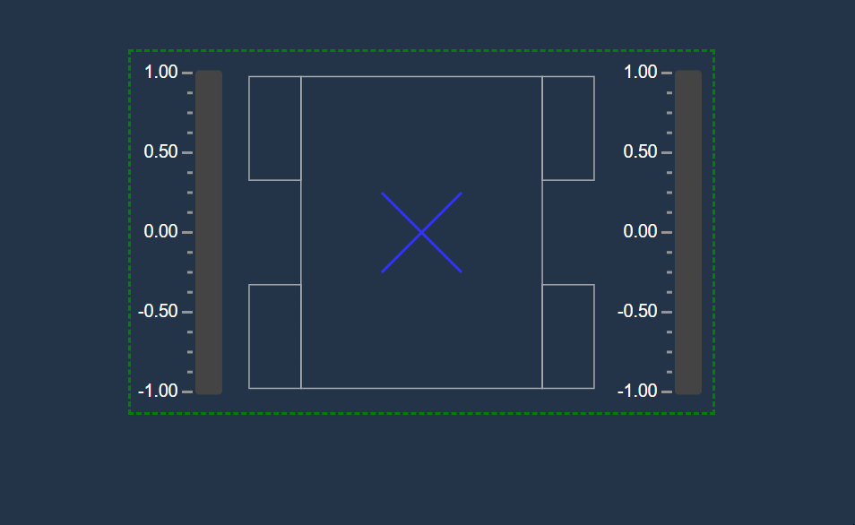

Setting Element Properties
==========================

Element behavior changes based on their properties. A selected element's property values can be set in the **Properties** view:

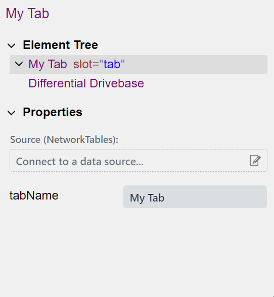

Property values can be changed through their input fields:

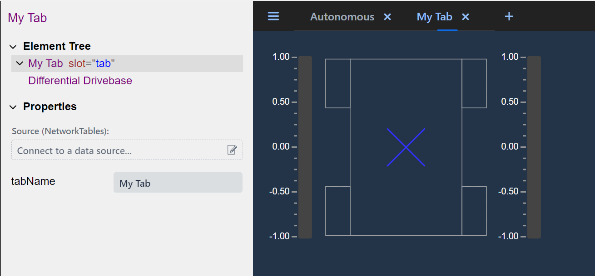

Property Sources and Robot Communication
========================================

Element properties can be controlled externally through sources such as NetworkTables. An element connected to NetworkTables can send to or receive updates from a physical or simulated robot. Below the dashboard will connect to OutlineViewer running in server mode when the NT4 address is set to "localhost":

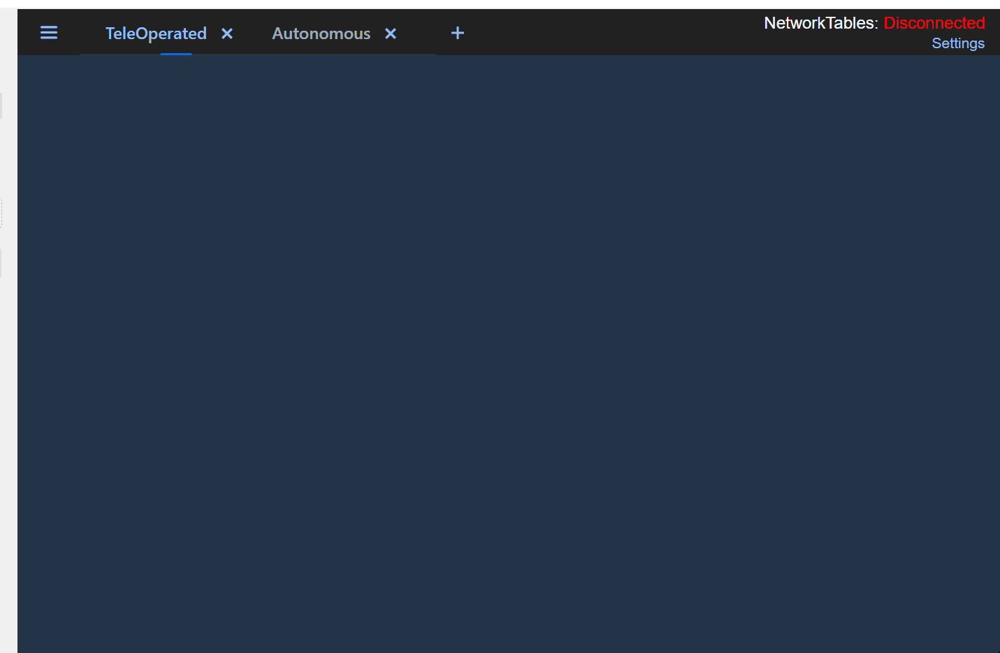

To connect to a physical robot, the "NT4 Server" setting can be changed from "localhost" to the IP address of the robot.

An element's source can be set through the "Source" input field at the top of the "Properties" view. The Source value can be changed by clicking on the "edit" button. Clicking on this button opens up the Sources dialog. From the dialog you can set the selected element's source:

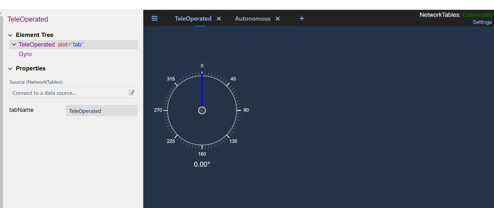

Above, the selected source is a table with sub entries "value", "Precision" and "Hide Label". These sub entries are converted to camelCase and mapped to the element's properties. If the element is assigned an entry as a source instead of a subtable, the entry's value will be mapped to the element's "primary" property:

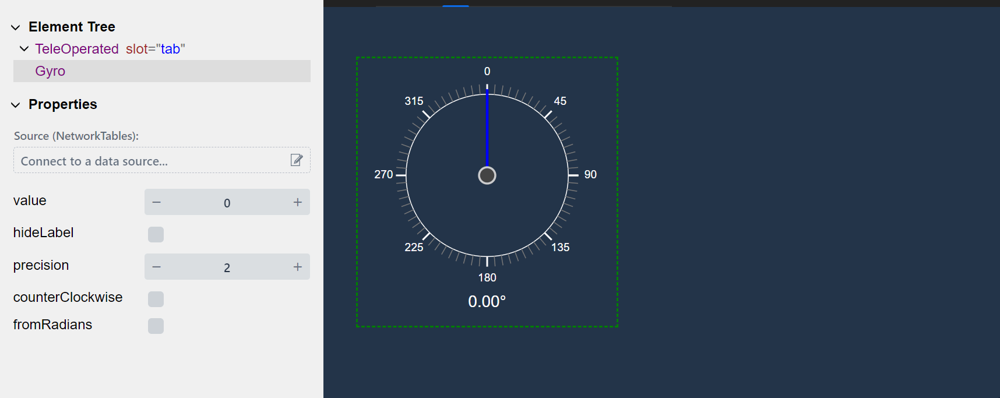

Elements can also update source values:

.. image:: ./images/dashboard/change-source-value-in-dashboard.gif
  :width: 850

Source Providers
================

- Sources can come from different places called "Providers". So far we've discussed only the "NetworkTables" provider but others exist as well. The Gamepad provider gets data from plugged in gamepads such as Xbox and Playstation controllers:

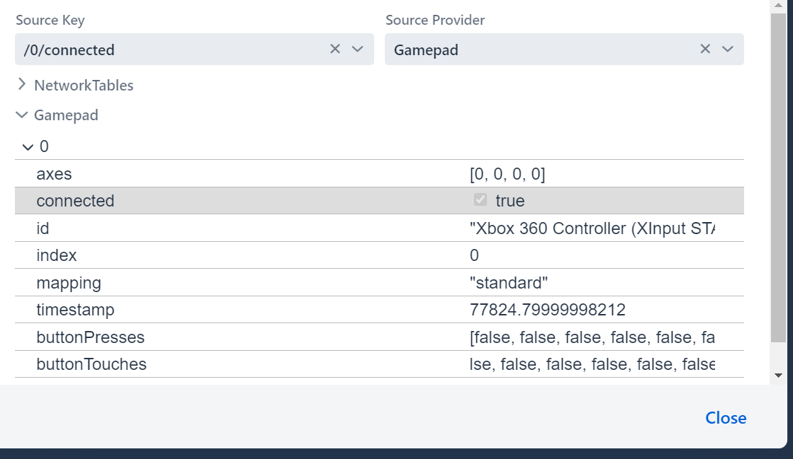

The element's source provider will show up in parentheses above the input field: 

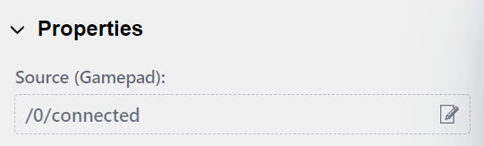

Themes
======

Themes can be changed in the settings menu. The available themes are "dark" and "light":

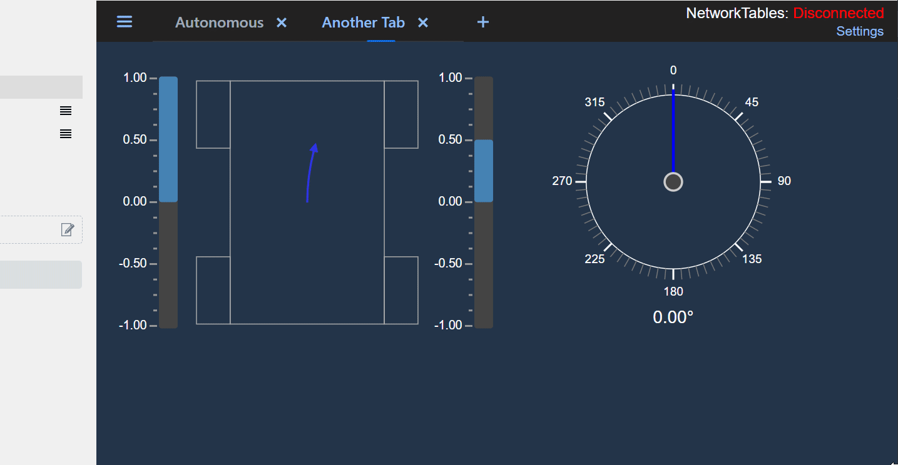

Saving and Opening Dashboards
=============================

Dashboards can be saved and reopened through the file menu:

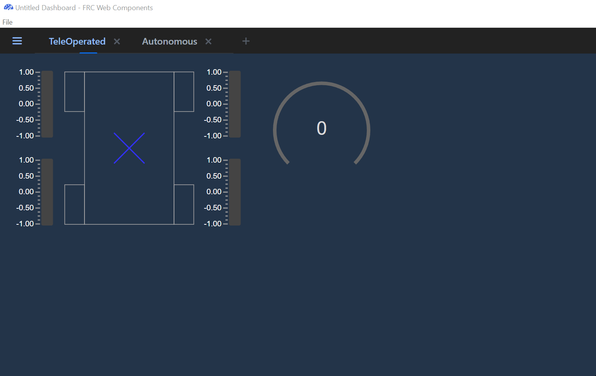

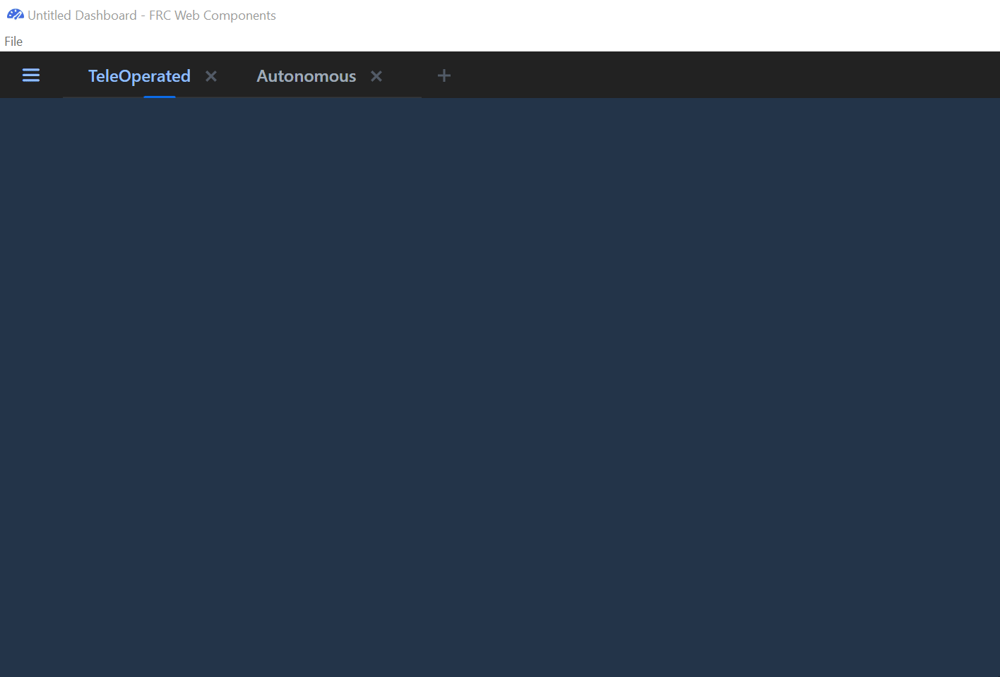

The filename of the opened dashboard will appear at the top of the window. If the current dashboard has not been saved to a file it will be labeled "Untitled Dashboard".

Importing Plugins
=================

