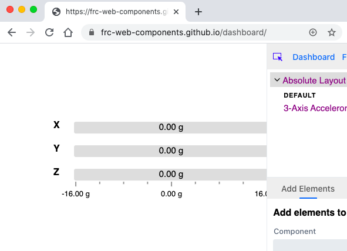
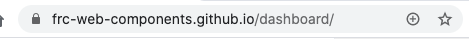
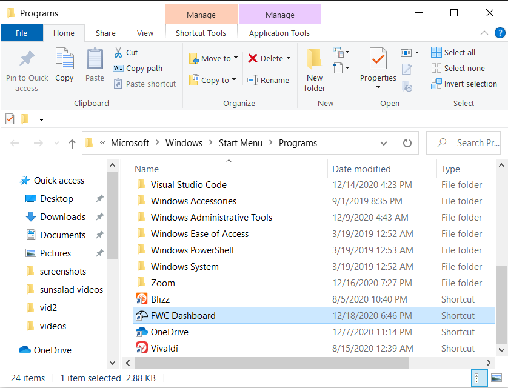
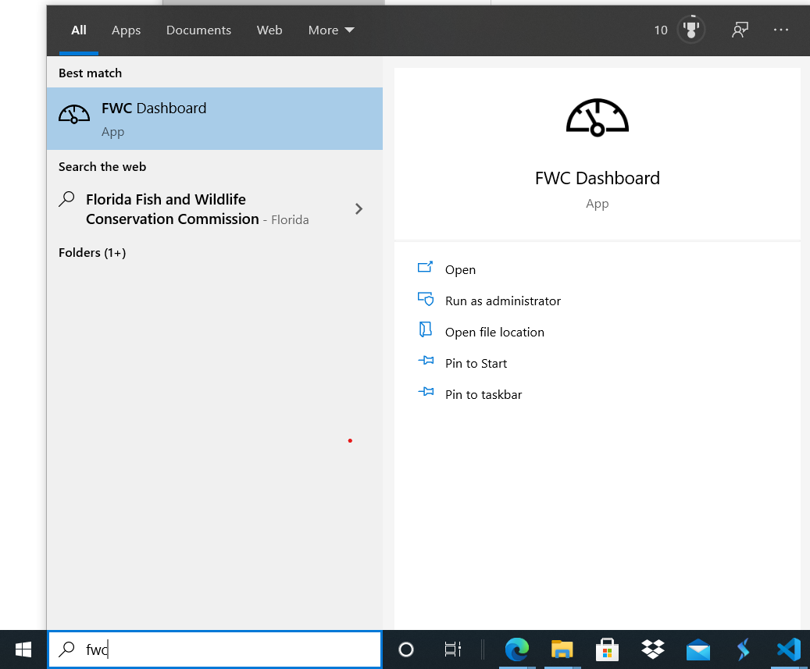
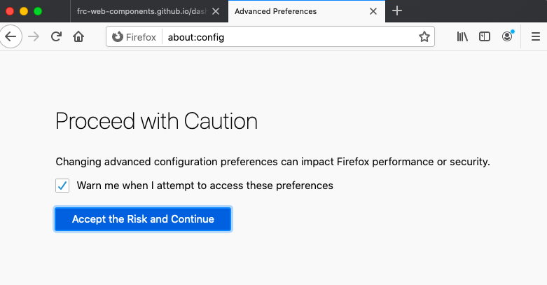
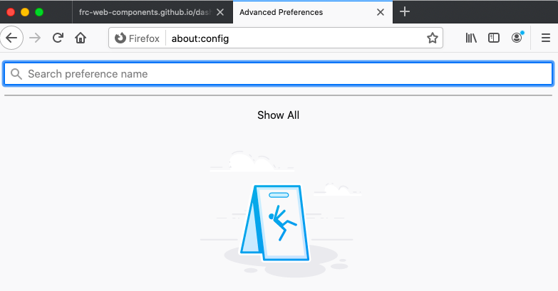
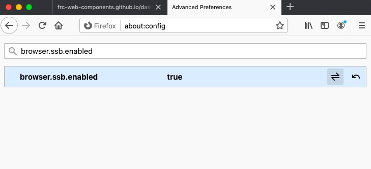
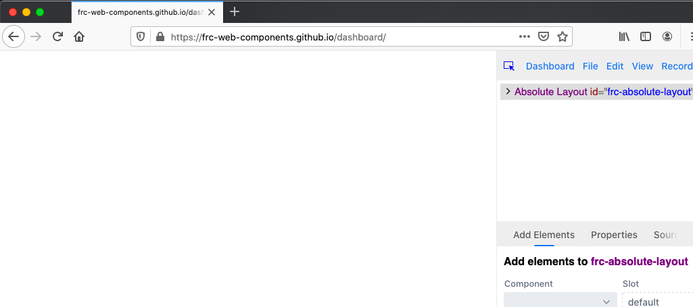
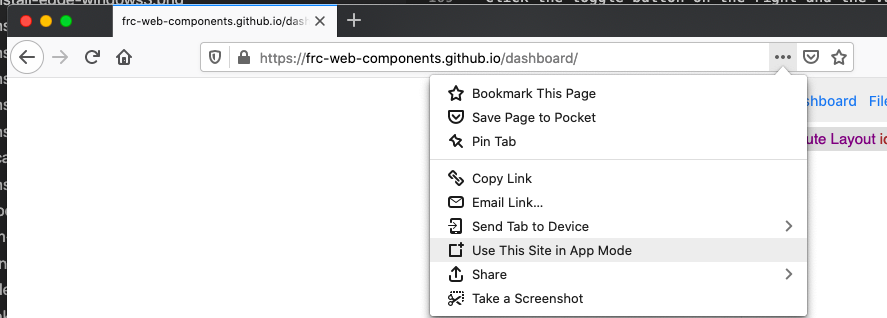
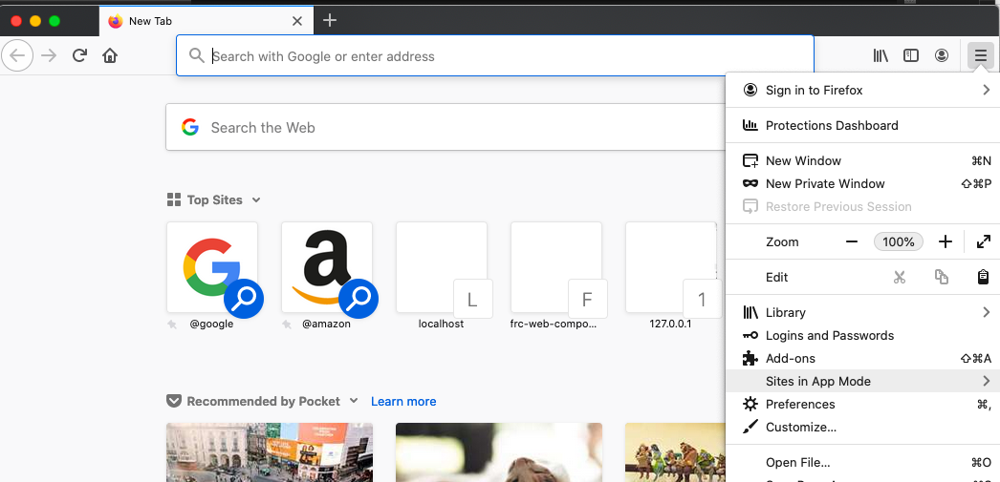

Installation
============

The FRC Web Component Dashboard is a web app that can installed to your computer for offline use (necessary when competing in FRC matches where internet access in unavailable) and be updated when newer versions and an internet connection become available.

The dashboard can be installed from here: https://frc-web-components.github.io/dashboard/

Installation steps differ slightly between each browser and operating system:

Chrome
------

You should see something like this when you visit the dashboard page in chrome:

You should see a plus button on the right side of the address bar:

Click it and a dialog to install the app should appear:

.. image:: ../images/install-chrome-mac3.png

On macs the app should now be installed in the "Chrome Apps" folder:

.. image:: ../images/install-chrome-mac4.png

You can then launch it from the "Chrome Apps" folder or by searching for "FWC Dashboard" using `Splotlight
<https://www.macobserver.com/tips/high-sierra-check-flight-status-spotlight/>`_:

.. image:: ../images/install-chrome-mac5.png

or by searching for it using the `Launchpad <https://support.apple.com/en-us/HT202635>`_:

.. image:: ../images/install-chrome-mac6.png

On windows the app should be installed in the "Chrome Apps" folder as well:

.. image:: ../images/install-chrome-windows.png

You can then launch it from the "Chrome Apps" folder or by searching for "FWC Dashboard" in the searchbar:

.. image:: ../images/install-chrome-windows2.png

You can also create a shortcut of the app and launch it from your desktop:

.. image:: ../images/install-chrome-windows3.png

Edge
----

You should see something like this when you visit the dashboard page in edge:

.. image:: ../images/install-edge-mac.png

You should see a plus button on the right side of the address bar:

.. image:: ../images/install-edge-mac2.png

Click it and a dialog to install the app should appear:

.. image:: ../images/install-edge-mac3.png

On macs the app should now be installed in the "Edge Apps" folder:

.. image:: ../images/install-edge-mac4.png

You can then launch it from the "Edge Apps" folder or by searching for "FWC Dashboard" using `Splotlight
<https://www.macobserver.com/tips/high-sierra-check-flight-status-spotlight/>`_:

.. image:: ../images/install-edge-mac5.png

or by searching for it using the `Launchpad <https://support.apple.com/en-us/HT202635>`_:

.. image:: ../images/install-edge-mac6.png

On windows the app should be installed in the "Programs" folder:

You can then launch it from the "Programs" folder or by searching for "FWC Dashboard" in the searchbar:

You can also create a shortcut of the app and launch it from your desktop:

.. image:: ../images/install-edge-windows3.png

Firefox
-------

Installing PWAs must be enabled before installing the dashboard using firefox.

To enable, first go to about:config in the address bar:

Click the "Accept the Risk and Continue" button. You should be presented with a search bar to search preferences:

Enter **browser.ssb.enabled** into the search bar. You should now see this:

.. image:: ../images/install-firefox-mac3.png

Click the toggle button on the right and the value should now read **true**:

Restart firefox and visit the dashboard page here: https://frc-web-components.github.io/dashboard/. You should now see something that looks like this:

In the address bar, click on the "page actions" button (the icon with three dots). Click on the "Use This Site in App Mode" menu item:

The dashboard should now be launched in its own window:

.. image:: ../images/install-firefox-mac7.png

The dashboard can now be accessed offline from the firefox hamburger menu:

Click on the "Sites in App Mode" menu item and you should see "FWC Dashboard" listed:

.. image:: ../images/install-firefox-mac9.png

Click on this and the dashboard will launch.

Safari
------