Dashbord Interface
==================

The dashboard interface has two modes:

#. **Edit Mode**, which is used to editor dashboards and create new ones.
#. **Live Mode**, which is used to interact with your robot using the dashboard you created in *Edit Mode*.

You can toggle between **Edit Mode** and **Live Mode** by pressing **Shift+E** on your keyboard. In **Live Mode** only the **dashboard area** is visible:

.. image:: ../images/interface/interface.png

In **Edit Mode** the **dashboard area** and the **dashboard editor** are visible:

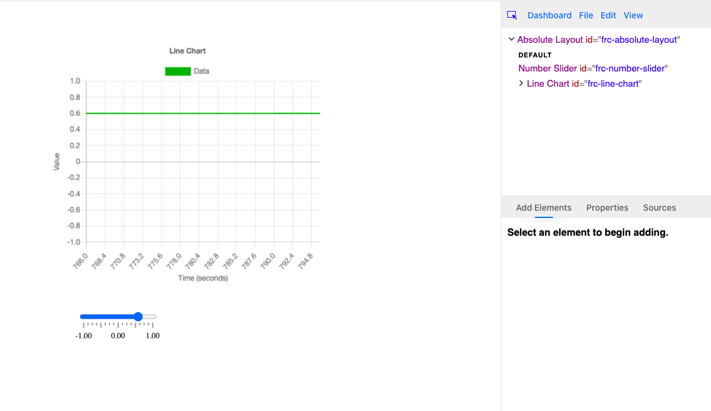

The border that separates the **dashboard area** and **dashboard editor** can be dragged to change the size of the areas. This is useful if you want to increase the editor size or if you want to hide it to reveal components that might be hidden behind it:

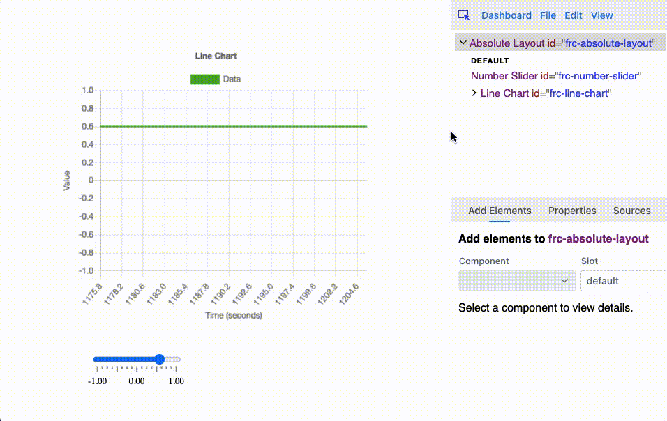

Selecting elements
------------------

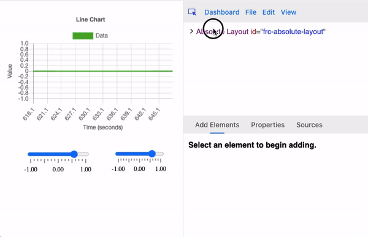

In order to add, edit or remove elements, they must be selected in **Edit Mode**. elements can be selected by either clicking on them in the dashboard or the **element tree**. The **element tree** is at the top of dashboard editor below the menu:

.. image:: ../images/interface/interface6.png

Each row in the **element tree** represents a different element added to the dashboard. A element is the parent of the element indented below it (the children). A element's children can be expanded and collapsed by clicking on the arrow on the left side of the element tree:

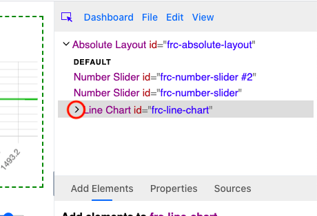

Sometimes while interacting with element you may want to prevent other elements from being selected. This can be done by toggling the **selection tool** in the **dashboard editor's** menu:

.. image:: ../images/interface/interface9.png

.. image:: ../images/interface/interface10.gif

Removing elements
-----------------

Selected elements can be removed by pressing the delete/backspace key or by clicking the **Delete element** menu item in the **Edit** menu:

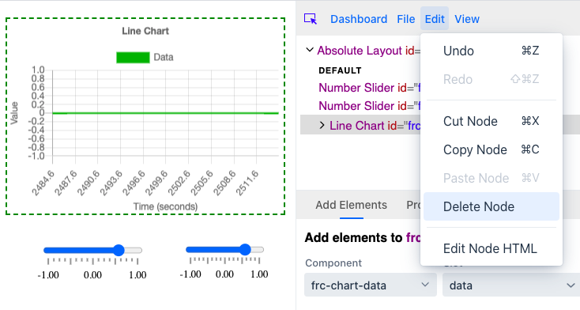

Note that removing a element will also remove its children.

Adding elements
---------------

All elements in a dashboard are direct children or ancestors of the root element. The root element is the topmost element in the element tree:

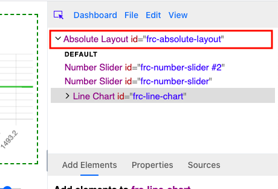

To add a element you must first select an element and then click on the **Add Elements** tab in the **element editor**:

.. image:: ../images/interface/interface12.gif

Then select a component from the **component dropdown** input field. There are many different categories of components to choose from. When you choose a component you can add it by clicking on the **Prepend Element** or **Append Element** buttons:

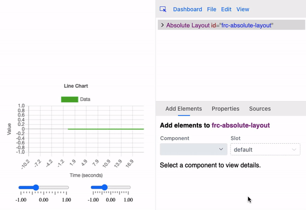

The components shown in the **component dropdown** is not the full list of components available. Only the components that can be added to the selected element are revealed. Some elements like the Gauge we added above can't contain other elements and will say as such:

.. image:: ../images/interface/interface14.png

Other components can only be added to certain elements. For example, only charts can contain chart data components:

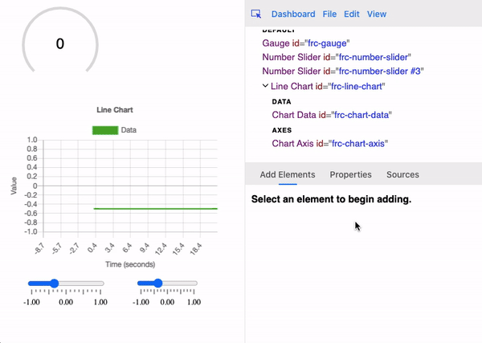

Some components have multiple distinct parts that can contain children. For example, the **line chart** component can contain both **chart data** and **chart axis** elements. These distinct parts are called **slots**. Most components have a single slot, but for components like the line chart, you can change what slot you want to add an element to by changing the **Slot** input field:

.. image:: ../images/interface/interface16.gif

Moving and resizing elements
----------------------------

A selected element can be moved by hovering over it and dragging it to another position:

.. image:: ../images/interface/interface17.gif

Note that the ability to move an element depends on its parent. For example, a checkbox group element can be moved, but individual checkbox elements inside the group can't.

A selected element can be resized by hovering over one of its corners or edges and dragging it:

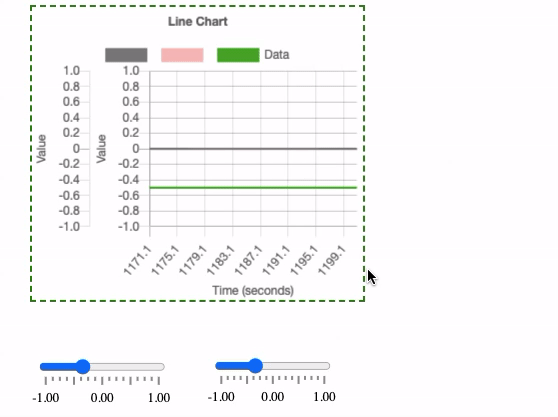

Note that some components can't be resized, or resizing is restriced to the vertical or horizontal axis:

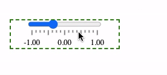

Copying, cutting and pasting elements
-------------------------------------

A selected element can be copied or cut using the **Cut Element** and **Copy Element** menu items in the **Edit** menu:

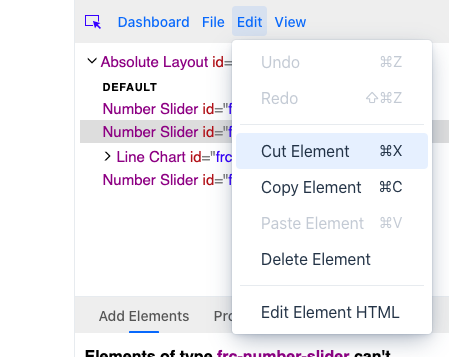

A selected element can also be cut using its keyboard shortcut (Ctrl+X on Windows and Command+X on Mac) and copied using its keyboard shortcut (Ctrl+C on Windows and Command+C on Mac).

When an element is copied or cut to the clipboard, its parent will become selected. Pasting an element will add it as a child of the selected element if possible (a copied checkbox can't be pasted into a line chart for example). You can paste an element in the clipboard using the **Paste Element** menu item in the **Edit** menu or using its keyboard shortcut (Ctrl+P on Windows and Command+P on Mac).

Note that when elements are copied/cut their children, grandchildren, etc. will be moved to the clipboard as well.

Changing element properties
---------------------------

Element properties can be changed by clicking on the **Properties** tab in the **element editor**:

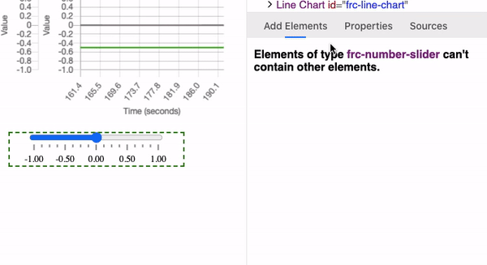

Every element property can be set with input fields on the **Properties** tab. For example, the number slider component has 4 properties:

#. Value (The number value of the slider)
#. Min (The lower bound of the slider)
#. Max (The upper bound of the slider)
#. Block Increment (Slider value can only move by increments of this number)

All of these properties can be changed with number input fields:

.. image:: ../images/interface/interface27.png

Note the other two input fields above the properties list:

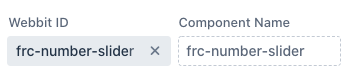

The **Webbit ID** value is a unique ID for the selected element. Every element must have one, and they can be changed by the user to help identify its purpose in the component tree:

.. image:: ../images/interface/interface29.gif

The **Component Name** input field simply shows the element's component name which can't be changed.

To confirm the changes to the property values click the green **Confirm** button at the bottom:

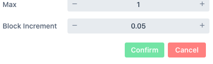

The red **Cancel** button to the right of the **Confirm** button will change the property input fields back to their current values. Note that these buttons will be disabled if all the current property fields and **Webbit ID** input field show their current values.

.. note:: If a property is connected to a source, its current value won't change by setting its input field in the properties tab, and the value shown in the input field might not match its current value. However, if an element loses its source value (this might happen if your connection to your robot is lost for example) or a source has not been set yet (such as when you first launch your dashboard) the property's value will change to the value last set in its input field in the properties tab.

Connecting element properties to NetworkTables and other sources
----------------------------------------------------------------

An element's properties can be externally controlled by setting its **source**. When a source's value is updated, any elements with properties controlled by that source will be updated as well.

To change a selected element's source click on the **Sources** tab in the **element editor**:

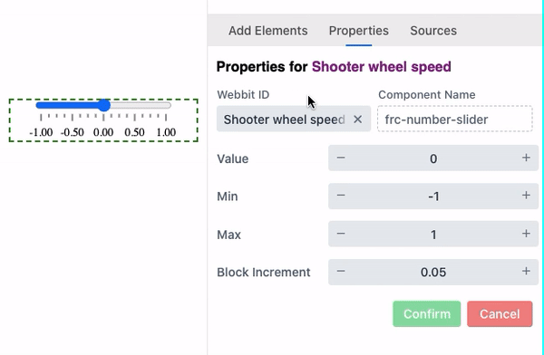

You can change the element's **source** by setting its **source key**. This can be done in a few ways. One is by typing the source key manually in the **Source Key** input field. Suggestions will appear allowing you to choose an existing source key without typing it out manually:

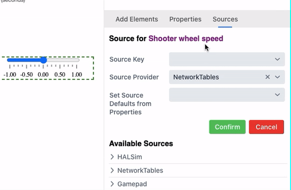

You can also set the source key using the source tree below:

.. image:: ../images/interface/interface33.gif

To confirm the change or cancel, click the green **Confirm** or red **Cancel** buttons:

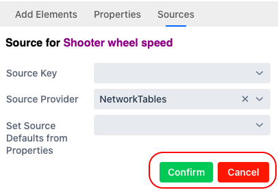

Notice how sources can have child sources as well as values:

.. image:: ../images/interface/interface35.png

Above we can see that NetworkTables has **three** sources:

- **/slider**
- **/slider/value**
- **/slider/max**

**/slider/value** and **/slider/max** are both child sources of **/slider**. When a source is assigned to an element, it tries to assign its child sources to the element's properties. For example, if a number slider element's source is **/slider**, its **value** property will be controlled by **/slider/value** and its **max** property will be controlled by **/slider/max**:

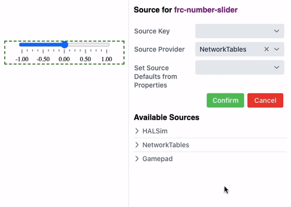

Notice in the gif above how the slider's current value and max value changed to match its source. The slider will continue updating whenever the sources assigned to its properties change:

.. image:: ../images/interface/interface37.gif

Interacting with an element on the dashboard can also modify the sources assigned to its properties:

.. image:: ../images/interface/interface38.gif

A source without children can also be assigned to an element:

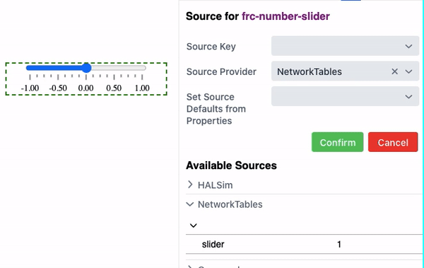

Although **/slider** does not match any of the **number slider** element's properties, it controls the value of the **value** property because **value** is the **primary** property of the **number slider** component. When an element's source is set to a source without children, its value is paired with that element's **primary** property.

Editing element HTML
--------------------

You can edit a selected element's raw HTML by using the **Edit Element HTML** menu items in the **Edit** menu:

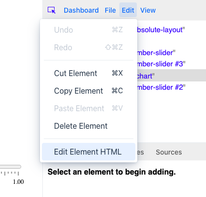

If you click on this menu item you should see a view like this:

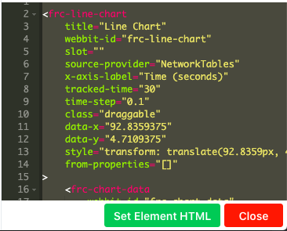

After editing the raw HTML you can confirm the change with the **Set Element HTML** button.

Note: this feature is only recommended for users that know how to write HTML. If you'd like to learn how to write HTML you should start with a tutorial such as this one: https://www.w3schools.com/html/default.asp

Styling elements
----------------

Features for styling and theming will be implemented in the future, but currently the only way to add custom styling is by using the **Edit Element HTML** feature. By editing the raw HTML of the root element you can add **style** elements with custom css and **class** attributes to elements.

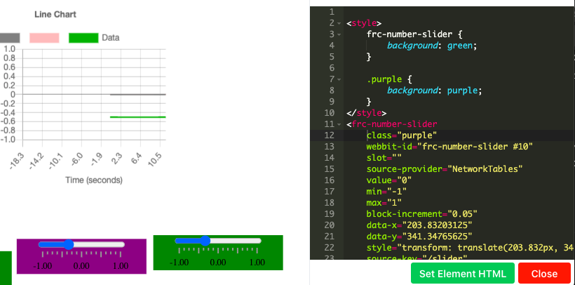

Style elements added will show up in the **element tree**:

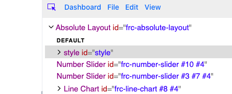

You can edit the raw HTML of individual style elements or elements you want to style by adding the class attribute to them.

Undoing and redoing
-------------------

You can undo or redo any change to the dashboard using the **Undo** or **Redo** menu items under the **Edit** menu:

.. image:: ../images/interface/interface25.png

You can also undo using its keyboard shortcut (Ctrl+Z on Windows and Command+Z on Mac) and redo using its keyboard shortcut (Ctrl+Y on Windows and Shift+Command+C on Mac).

Saving and renaming layouts
---------------------------

The name of your dashboard appears in the title at the top of the dashboard app:

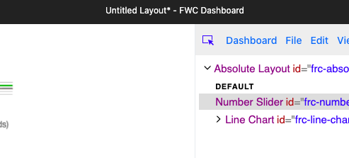

The name is the first part of the title before the dash:

.. image:: ../images/interface/interface41.png

The dashboard's name in this case is **Untitled Layout**. The asterisk at the end is not part of the name, but indicates that there are unsaved changes. You can save changes to the dashboard using the **Save Layout** menu item under the **File** menu:

.. image:: ../images/interface/interface42.png

You can also save using its keyboard shortcut (Ctrl+S on Windows and Command+S on Mac).

After saving the asterisk should disappear in the title:

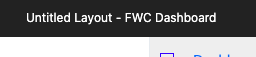

You can rename the dashboard using the **Rename Layout** menu item under the **File** menu:

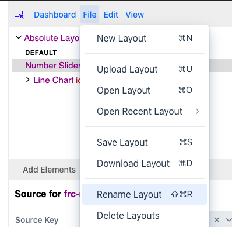

You can also rename the layout using its keyboard shortcut (Ctrl+R on Windows and Command+R on Mac).

Renaming the layout will open up a dialog allowing you to set the new name of the layout in an input field:

.. image:: ../images/interface/interface45.png

Click on the green **Confirm** button to change the layout name, and the new name should appear in the title at the top of the app. Click the **Close** button in the dialog to go back to editing your layout.

Downloading and uploading layouts
---------------------------------

Opening layouts
---------------

Creating new layouts
--------------------

Loading extensions and custom components
----------------------------------------