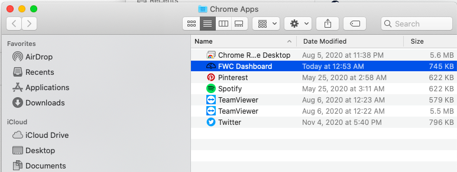
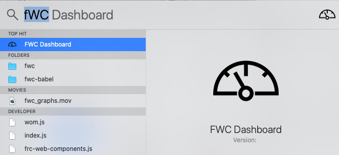
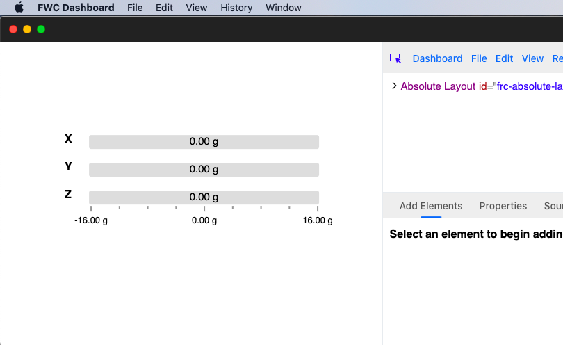
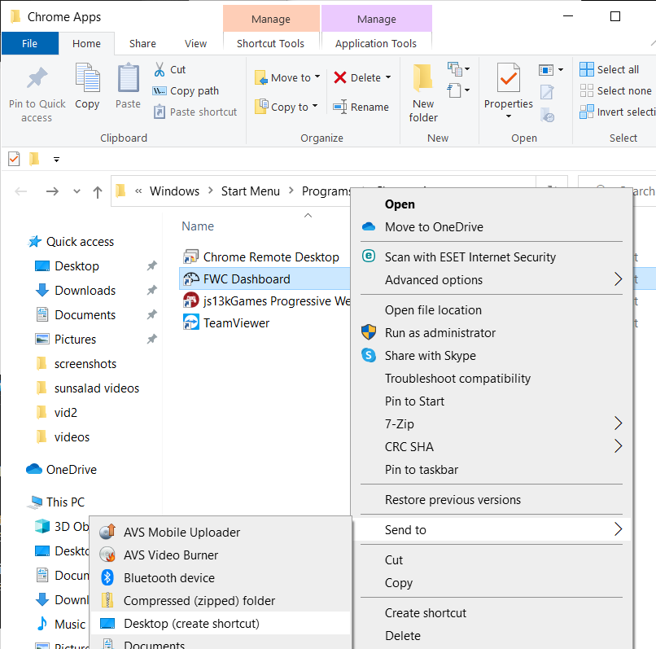

Running the Dashboard
=====================

These are the steps you need to perform to run the dashboard:

#. To run the dashboard you must launch the app that was installed using a browser such as chrome, edge or firefox. Steps for each browser can be found below.
#. Most components use NetworkTables to communicate information between the dashboard and the robot. Communicating over NetworkTables between a webpage and the robot requires a python package called **pynetworktables2js** be installed and run. To learn more follow the steps here: :ref:`pynetworktables2js`
#. (optional) If you want to simulate your robot code using the FWC Dashboard as a front-end, follow the steps here: :ref:`HALSim Websocket`

To run the dashboard you must launch the PWA that was installed using a browser such as chrome, edge or firefox. Most components generally use NetworkTables to communicate information between the dashboard and the robot. To 

Chrome Dashboard App
--------------------

On macs the app should be installed in the home directory under **Applications** -> **Chrome Apps**:

You can then launch it from the "Chrome Apps" folder or by searching for "FWC Dashboard" using `Splotlight
<https://www.macobserver.com/tips/high-sierra-check-flight-status-spotlight/>`_:

or by searching for it using the `Launchpad <https://support.apple.com/en-us/HT202635>`_:

.. image:: ../images/install-chrome-mac6.png

Clicking on the dashboard icon should launch it:

To launch multiple dashboard windows, go to the **File** menu and click **New Window**:

.. image:: ../images/running-chrome-mac2.png

On windows the app should be installed in the "Chrome Apps" folder as well:

.. image:: ../images/install-chrome-windows.png

You can then launch it from the "Chrome Apps" folder or by searching for "FWC Dashboard" in the searchbar:

.. image:: ../images/install-chrome-windows2.png

You can also create a shortcut of the app and launch it from your desktop:

Clicking on the dashboard icon should launch it:

Edge Dashboard App
------------------

Firefox Dashboard App
---------------------

Safari Dashboard App
--------------------

.. _pynetworktables2js:

pynetworktables2js
------------------

.. _HALSim Websocket:

HALSim Websocket
----------------