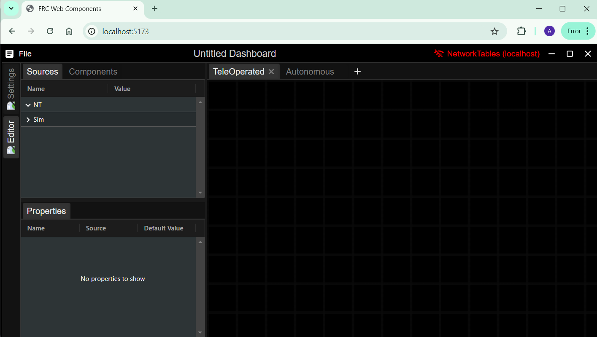

# Plugin Development

[<- Home](/README.md)

- [Creating your first plugin](#creating-your-first-plugin)
- [Creating custom elements](#creating-custom-elements)
- [Theming](#theming)
- [Including Static Assets](#including-static-assets)
- [Component Config](#component-config)
  - [Selectors](#selectors)
  - [Properties](#properties)
  - [Property Input Config](#property-input-config)

FRC Web Components (FWC) dashboard can be extended through its plugin system using the `@frc-web-components/app` package. Below is a simple plugin which adds a custom component created in svelte to the dashboard:

```typescript
import {
  addComponents,
  createWebComponent,
  numberProp,
} from '@frc-web-components/app';
import MyElement from './MyElement.svelte';

export const mySvelteElement = createWebComponent(
  {
    dashboard: {
      name: 'My Svelte Element',
      description: '',
      defaultSize: { width: 100, height: 100 },
      minSize: { width: 20, height: 20 },
    },
    acceptedSourceTypes: ['Number'],
    primaryProperty: 'count',
    properties: {
      count: numberProp(),
    },
  },
  'my-svelte-element',
  MyElement.element!,
);

addComponents({
  mySvelteElement,
});
```

FWC provides a cli tool which generates a sample plugin that can be used to help get you started with writing your own plugin:

```bash
$ npm init fwc@latest <name>
```

Note: You'll need <span class="title-ref">node</span> installed to run
the above command: <https://nodejs.org/en/download/>

# Creating your first plugin

To get started, open a terminal and enter in the following command:

```bash
$ npm init fwc@latest my-first-plugin
```

After being prompted with a few questions to help setup your plugin, the plugin project will be created and installed. The cli tool provides templates to create components using [lit](https://lit.dev/), [react](https://react.dev/) or [svelte](https://svelte.dev/):


Once installed, a new folder should have been created named after the
value you passed into the CLI tool. To launch the plugin, navigate to the plugin root and run the `npm run dev` command:

```bash
$ cd ./my-first-plugin
$ npm run dev
```

You should see something like this in your terminal:


If the plugin does not launch automatically, copy the URL and paste it into a browser. You should see a web page that looks like this:



From here you'll be able to test the functionality of your plugin in a browser instance of the FWC Dashboard. By default the plugin CLI tool includes an example component you can use to get started. The components you create for your plugin can be tested by adding them to the dashboard layout. Elements can be added by dragging them into the layout:


Let's open the plugin source code to see what's inside. Visual Studio Code is recommended, but you are free to use any editor you wish:


The root of your plugin source code is in the **index.ts** file. It calls the `createWebComponent` and `addComponents` functions which lets you extend the components that can be added to the dashboard app. Let's look a little closer at the code above:

```ts
export const mySvelteElement = createWebComponent(
  {
    dashboard: {
      name: 'My Svelte Element',
      description: '',
      defaultSize: { width: 130, height: 50 },
      minSize: { width: 20, height: 20 },
    },
    acceptedSourceTypes: ['Number'],
    primaryProperty: 'count',
    properties: {
      count: numberProp(),
    },
  },
  'my-svelte-element',
  MyElement.element!,
);

addComponents({
  mySvelteElement,
});
```

The above adds a new component to the FWC Dashboard interface. Note that the above is just a config for the **my-svelte-element** HTML element and not the code for the **my-svelte-element** element itself. The above configuration is required by the dashboard so it knows things like how to add the component to the interface, and information about its properties so they can be controlled using external sources such as NetworkTables.

Some config fields are used for display purposes only, such as the **name** field.

Now let's take a look at the code for the **my-svelte-element** component.

# Creating custom elements

The source code for the **my-svelte-element** element can be found in the **MyElement.svelte** file under the **src** folder of your plugin:

```javascript
<svelte:options customElement="my-svelte-element" />

<script lang="ts">
  import { getAssetUrl } from  '@frc-web-components/app';
  let { count = 0, setProperty } = $props();
</script>

<button onclick={() => setProperty('count', count + 1)}>
  
  Party Guests: {count}
</button>

<style>
  button {
    background: var(--my-svelte-element-background, cadetblue);
    color: var(--my-svelte-element-color, black);
    border: none;
    border-radius: 3px;
    padding: 8px;
    display: inline-flex;
    align-items: center;
    gap: 8px;
    width: 100%;
    height: 100%;
  }
</style>
```

The component above was created using [svelte](https://svelte.dev/), a library thats able to build web components that act just like built-in elements. There are many resources online to learn about the web component standard such as this one: <https://kinsta.com/blog/web-components/>

Web components are supported by all major browsers and can be built
using many libraries and frameworks. The component above could have also been built using React:

```tsx
import { CSSProperties } from 'react';
import {
  getAssetUrl,
  createComponent,
  numberProp,
} from '@frc-web-components/app';

export const myElement = createComponent(
  {
    dashboard: {
      name: 'My React Element',
      description: '',
      defaultSize: { width: 130, height: 50 },
      minSize: { width: 20, height: 20 },
    },
    acceptedSourceTypes: ['Number'],
    primaryProperty: 'count',
    properties: {
      count: numberProp(),
    },
  },
  ({ count, setProperty }) => {
    const styles: CSSProperties = {
      background: 'var(--my-react-element-background, cadetblue)',
      color: 'var(--my-react-element-color, black)',
      border: 'none',
      borderRadius: '3px',
      padding: '8px',
      display: 'inline-flex',
      alignItems: 'center',
      gap: '8px',
      width: '100%',
      height: '100%',
    };
    return (
      <button
        style={styles}
        onClick={() => {
          setProperty('count', count + 1);
        }}
      >
        
        Party Guests: {count}
      </button>
    );
  },
);
```

A list of templates with examples can be found here: <https://webcomponents.dev/new>.

# Theming

Theming in the FWC dashboard app is done using [CSS variables](https://developer.mozilla.org/en-US/docs/Web/CSS/Using_CSS_custom_properties).

As an example take the following style rule for the `my-svelte-element` component:

```css
color: white;
```

To make this rule themable change it to the following:

```css
color: var(--my-svelte-element-color, white);
```

`--my-svelte-element-color` is the CSS variable. CSS variables are prefixed with `--`. To ensure uniqueness and to prevent accidentally overwriting existing rules prepend your variable with the element name. `white` is the default value if a theme is not set.

To add per theme rules add the following code:

```typescript
import { addThemeRules } from '@frc-web-components/app';

addThemeRules('dark', {
  '--my-svelte-element-color': 'black',
});

addThemeRules('light', {
  '--my-svelte-element-color': 'white',
});
```

# Including Static Assets

Static assets like such as images should be placed in the `/public/assets` folder. They can be included into the app by calling the `getAssetUrl` function. For example:

```typescript
import { getAssetUrl } from '@frc-web-components/app';

const url: string = getAssetUrl('party.svg');
```

The above URL can then be used as the src of an image element:

```html

```

## Adding components

Each **ComponentConfig** added to the FWC Dashboard requires a
**type** so the dashboard interface knows which config should be
applied to component added to the dashboard:

```typescript
import { addComponents } from '@frc-web-components/app';

addComponents({
  [type: string]: ComponentConfig
});
```

# Component Config

For elements to be added and handled by the FWC Dashboard, they need an
associated **Component Config**. Below are the configuration options needed
to define an **Component Config**:

```javascript
{
  dashboard: {
    // The display name for the component
    name: string,
    // A description for the component
    description: string,
    // A default width and height in pixels
    defaultSize: { width: number, height: number },
    // The minimum width and height in pixels
    minSize: { width: number, height: number },
    // An optional array of children to add to the component my default. Each child must contain the type of component to add, a name, and optional property values to default to.
    children?: {
      type: string,
      name: string,
      properties?: Record<string, unknown>,
    }[],
    // Set to false if you do not want to be able to directly add this component to the dashboard. This is useful if it should only be added as a child of another component.
    topLevel?: boolean
  },
  // This is useful if the component is usually associated with a particular source.
  // e.g. Robot code publishes field related info to "/SmartDashboard/Field" in NetworkTables
  // so "defaultSource.key" is set to this key and "defaultSource.provider" to "NT"
  // for the Field2d element.
  defaultSource?: {
    key: string,
    provider: string,
  },
  // Optional list of components that can be added as children to this component
  children?: {
    // The type of component that is addable
    type: string,
    // Used for display purposes
    propertyTabName?: string,
  }[],
  // primaryProperty is the property a source assigned to the component will bind to
  primaryProperty?: string,
  // This allows a component to be converted to this component if the type of its source is the same as one of the acceptedSourceTypes. Used to populate the "Show As..." context submenu
  acceptedSourceTypes?: string[],
  // Properties are used to control how the element looks and behaves. They can be bound
  // to external sources such as NetworkTables
  properties: {
    [propertyName: string]: PropertyConfig
  },
}
```

## Properties

Properties are used to control how the element looks and behaves. They can be bound to external sources such as NetworkTables. Each property must be defined within the component config:


Properties can be added with the following functions exported by the plugin API.

```typescript

import {
  createComponent,
  numberProp,
  booleanProp,
  stringProp,
  colorProp,
  markdownProp,
  numberArrayProp,
  stringArrayProp,
  stringDropdownProp,
} from '@frc-web-components/app';

export const myElement = createComponent(
  {
    properties: {
      someNum: numberProp(),
      someBool: booleanProp(),
      someString: stringProp(),
      someColor: colorProp(),
      someMarkdown: markdownProp(),
      someNumArray: numberArrayProp(),
      someStringArray: stringArrayProp(),
      someDropdown: stringDropdownProp(),
    },
```

## These are the following types of properties that can be used
