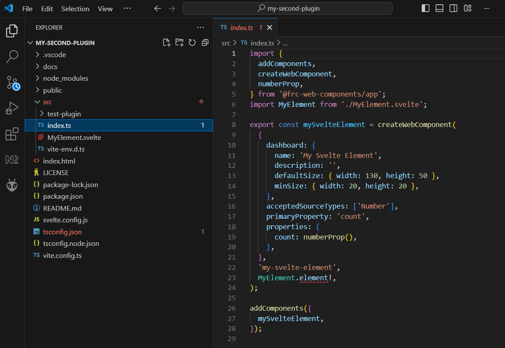

# Plugin Development

[<- Home](/README.md)

- [Creating your first plugin](#creating-your-first-plugin)
- [Creating custom elements](#creating-custom-elements)
- [Theming](#theming)
- [Including Static Assets](#including-static-assets)
- [Component Config](#component-config)
  - [Selectors](#selectors)
  - [Properties](#properties)
  - [Property Input Config](#property-input-config)

FRC Web Components (FWC) dashboard can be extended through its plugin system using the `@frc-web-components/app` package. Below is a simple plugin which adds a custom component created in svelte to the dashboard:

```typescript
import {
  addComponents,
  createWebComponent,
  numberProp,
} from '@frc-web-components/app';
import MyElement from './MyElement.svelte';

export const mySvelteElement = createWebComponent(
  {
    dashboard: {
      name: 'My Svelte Element',
      description: '',
      defaultSize: { width: 100, height: 100 },
      minSize: { width: 20, height: 20 },
    },
    acceptedSourceTypes: ['Number'],
    primaryProperty: 'count',
    properties: {
      count: numberProp(),
    },
  },
  'my-svelte-element',
  MyElement.element!,
);

addComponents({
  mySvelteElement,
});
```

FWC provides a cli tool which generates a sample plugin that can be used to help get you started with writing your own plugin:

```bash
$ npm init fwc@latest <name>
```

Note: You'll need <span class="title-ref">node</span> installed to run
the above command: <https://nodejs.org/en/download/>

# Creating your first plugin

To get started, open a terminal and enter in the following command:

```bash
$ npm init fwc@latest my-first-plugin
```

After being prompted with a few questions to help setup your plugin, the plugin project will be created and installed. The cli tool provides templates to create components using [lit](https://lit.dev/), [react](https://react.dev/) or [svelte](https://svelte.dev/):


Once installed, a new folder should have been created named after the
value you passed into the CLI tool. To launch the plugin, navigate to the plugin root and run the `npm run dev` command:

```bash
$ cd ./my-first-plugin
$ npm run dev
```

You should see something like this in your terminal:


If the plugin does not launch automatically, copy the URL and paste it into a browser. You should see a web page that looks like this:


From here you'll be able to test the functionality of your plugin in a browser instance of the FWC Dashboard. By default the plugin CLI tool includes an example component you can use to get started. The components you create for your plugin can be tested by adding them to the dashboard layout. Elements can be added by dragging them into the layout:


Let's open the plugin source code to see what's inside. Visual Studio Code is recommended, but you are free to use any editor you wish:



The root of your plugin source code is in the **index.ts** file. It calls the `createWebComponent` and `addComponents` functions which lets you extend the components that can be added to the dashboard app. Let's look a little closer at the code above:

```ts
export const mySvelteElement = createWebComponent(
  {
    dashboard: {
      name: 'My Svelte Element',
      description: '',
      defaultSize: { width: 130, height: 50 },
      minSize: { width: 20, height: 20 },
    },
    acceptedSourceTypes: ['Number'],
    primaryProperty: 'count',
    properties: {
      count: numberProp(),
    },
  },
  'my-svelte-element',
  MyElement.element!,
);

addComponents({
  mySvelteElement,
});
```

The above adds a new component to the FWC Dashboard interface. Note that the above is just a config for the **my-svelte-element** HTML element and not the code for the **my-svelte-element** element itself. The above configuration is required by the dashboard so it knows things like how to add the component to the interface, and information about its properties so they can be controlled using external sources such as NetworkTables.

Some config fields are used for display purposes only, such as the **name** field.

Now let's take a look at the code for the **my-svelte-element** component.

# Creating custom elements

The source code for the **my-svelte-element** element can be found in the **MyElement.svelte** file under the **src** folder of your plugin:

```javascript
<svelte:options customElement="my-svelte-element" />

<script lang="ts">
  import { getAssetUrl } from  '@frc-web-components/app';
  let { count = 0, setProperty } = $props();
</script>

<button onclick={() => setProperty('count', count + 1)}>
  
  Party Guests: {count}
</button>

<style>
  button {
    background: var(--my-svelte-element-background, cadetblue);
    color: var(--my-svelte-element-color, black);
    border: none;
    border-radius: 3px;
    padding: 8px;
    display: inline-flex;
    align-items: center;
    gap: 8px;
    width: 100%;
    height: 100%;
  }
</style>
```

The component above was created using [svelte](https://svelte.dev/), a library thats able to build web components that act just like built-in elements. There are many resources online to learn about the web component standard such as this one: <https://kinsta.com/blog/web-components/>

Web components are supported by all major browsers and can be built
using many libraries and frameworks. The component above could have also been built using React:

```tsx
import { CSSProperties } from 'react';
import {
  getAssetUrl,
  createComponent,
  numberProp,
} from '@frc-web-components/app';

export const myElement = createComponent(
  {
    dashboard: {
      name: 'My React Element',
      description: '',
      defaultSize: { width: 130, height: 50 },
      minSize: { width: 20, height: 20 },
    },
    acceptedSourceTypes: ['Number'],
    primaryProperty: 'count',
    properties: {
      count: numberProp(),
    },
  },
  ({ count, setProperty }) => {
    const styles: CSSProperties = {
      background: 'var(--my-react-element-background, cadetblue)',
      color: 'var(--my-react-element-color, black)',
      border: 'none',
      borderRadius: '3px',
      padding: '8px',
      display: 'inline-flex',
      alignItems: 'center',
      gap: '8px',
      width: '100%',
      height: '100%',
    };
    return (
      <button
        style={styles}
        onClick={() => {
          setProperty('count', count + 1);
        }}
      >
        
        Party Guests: {count}
      </button>
    );
  },
);
```

A list of templates with examples can be found here: <https://webcomponents.dev/new>.

# Theming

Theming in the FWC dashboard app is done using [CSS variables](https://developer.mozilla.org/en-US/docs/Web/CSS/Using_CSS_custom_properties).

As an example take the following style rule for the `my-svelte-element` component:

```css
color: white;
```

To make this rule themable change it to the following:

```css
color: var(--my-svelte-element-color, white);
```

`--my-svelte-element-color` is the CSS variable. CSS variables are prefixed with `--`. To ensure uniqueness and to prevent accidentally overwriting existing rules prepend your variable with the element name. `white` is the default value if a theme is not set.

To add per theme rules add the following code:

```typescript
import { addThemeRules } from '@frc-web-components/app';

addThemeRules('dark', {
  '--my-svelte-element-color': 'black',
});

addThemeRules('light', {
  '--my-svelte-element-color': 'white',
});
```

# Including Static Assets

Static assets like such as images should be placed in the `/public/assets` folder. They can be included into the app by calling the `getAssetUrl` function. For example:

```typescript
import { getAssetUrl } from '@frc-web-components/app';

const url: string = getAssetUrl('party.svg');
```

The above URL can then be used as the src of an image element:

```html

```

# Component Config

For elements to be added and handled by the FWC Dashboard, they need an
associated **Component Config**. Below are the configuration options needed
to define an **Component Config**:

```javascript
{
  dashboard: {
    // The display name for the component
    name: string,
    // A description for the component
    description: string,
    // A default width and height in pixels
    defaultSize: { width: number, height: number },
    // The minimum width and height in pixels
    minSize: { width: number, height: number },
    // An optional array of children to add to the component my default. Each child must contain the type of component to add, a name, and optional property values to default to.
    children?: {
      type: string,
      name: string,
      properties?: Record<string, unknown>,
    }[],
    // Set to false if you do not want to be able to directly add this component to the dashboard. This is useful if it should only be added as a child of another component.
    topLevel?: boolean
  },
  // This is useful if the component is usually associated with a particular source.
  // e.g. Robot code publishes field related info to "/SmartDashboard/Field" in NetworkTables
  // so "defaultSource.key" is set to this key and "defaultSource.provider" to "NT"
  // for the Field2d element.
  defaultSource?: {
    key: string,
    provider: string,
  },
  // Optional list of components that can be added as children to this component
  children?: {
    // The type of component that is addable
    type: string,
    // Used for display purposes
    propertyTabName?: string,
  }[],
  //
  acceptedSourceTypes?: string[],
  //
  primaryProperty?: string,
  // Properties are used to control how the element looks and behaves. They can be bound
  // to external sources such as NetworkTables
  properties: {
    [propertyName: string]: PropertyConfig
  },
}
```

## Selectors

Each **ComponentConfig** added to the FWC Dashboard requires a
**type** so the dashboard interface knows which config should be
applied to component added to the dashboard:

```typescript
addComponents({
  [type: string]: ComponentConfig
});
```

## Properties

Properties config is used to connect your element's properties and
attributes to external sources such as NetworkTables:

```javascript
dashboard.addElements({
  'some-element': {
    properties: {
      [propertyName: string]: PropertyConfig
    }
  },
});
```

**propertyName** is a string in camelCase format used to map sources to
your elements. For example, take the properties from the **frc-gauge**
component:

```javascript
properties: {
  min: { type: 'Number' },
  max: { type: 'Number', defaultValue: 100 },
  value: { type: 'Number', primary: true },
},
```

Let's see how a Gauge's properties can be controlled in the dashboard
using NetworkTables:


The element's source was set to the NetworkTables key "/gauge". Since
"/gauge" is a subtable, its "children" will be mapped to the element's
properties. Note that even though the keys "/gauge/Max" and
"/gauge/Value?!" are not exact matches for the "max" and "value"
properties they are still mapped because internally FWC converts keys to
camelCase.

Now let's look at how to configure individual properties:

```javascript
{
  // This is the only required field and is used by the dashboard to know what type
  // of value element expects for that property. For example, a number input field
  // might have a property "value" that is type 'Number' and a property "disabled"
  // that is type 'Boolean'. 'SourceProvider' and 'Store' are special properties
  // that are used by FWC to inject the SourceProvider and Store object for more
  // advanced use cases.
  type: 'String' | 'Boolean' | 'Number' | 'Array' | 'Object' | 'SourceProvider' | 'Store',
  // Optional field. The type of value you provide is determined by the 'type' field.
  // This value will default to '' for 'String' type, false for 'Boolean' type,
  // 0 for 'Number' type, [] for 'Array' type, and {} for 'Object' type
  defaultValue?: string | boolean | number | Array<unknown> | Record<string, unknown>,
  // Property values can be get or set through an element's attribute or property
  // on the element object itself. At least one of the 'attribute' and 'property'
  // fields here should be set. 'property' will be set to the 'propertyName' value.
  // You should explicitly set 'property' to false or null if the element does not
  // have one.
  attribute?: string | null | false,
  property?: string | null | false,
  // Optional description used for display purposes.
  description?: string,
  // Whether the property value when set should reflect back to the element's attribute.
  // This is used by the dashboard to detect changes to the property value and send
  // updates to the external source.
  reflect?: boolean,
  // If the source is a value instead of a table, it will be mapped to this property if
  // primary is set to true. Only one property should be be the primary value. Defaults
  // to false.
  primary?: boolean,
  // For the dashboard to send updates to external sources based on changes to property
  // values, it needs some way to detect that the property value has changed. If the
  // element emits an event when the property changes, the dashboard can detect updates
  // by listening to the event.
  changeEvent?: string,
  // Optional configuration for the input control used to set the property value in
  // the dashboard
  input?: PropertyInputConfig
}
```

## Property Input Config

The **input** config option for properties is used to control how the
property input behaves on the dashboard. The **input** config option
takes on the following structure:

```javascript
{
  type?: string,
  [option: string]: unknown
}
```

The current available types are:

- String
- Number
- Boolean
- Array
- StringArray
- BooleanArray
- NumberArray
- Textarea
- StringDropdown
- ColorPicker

By default **input.type** field will be equal to the property's type.
For example:

```javascript
dashboard.addElements({
  'some-element': {
    properties: {
      someProp: { type: 'String' },
    },
  },
});
```

Although **input** is not set in the **someProp** property, it will
default to the following:

```javascript
properties: {
  someProp: {
    type: 'String',
    input: { type: 'String' }
  }
}
```

The above property will be displayed as a text input field on the
dashboard:


What if we had a property that took in a a hex color? Although we could
store the data as a **String**, displaying this in a text input field
isn't very pretty.

```javascript
properties: {
  color: {
    type: 'String';
  }
}
```

The above property would be displayed as the following if the current
hex value was red:


It would be far better in this case if we displayed this using a color
picker:

```javascript
properties: {
  color: {
    type: 'String',
    input: { type: 'ColorPicker' }
  }
}
```

The above property would be displayed as the following if the current
hex value was red:


Let's look at the configs for the available input types in more detail.

## String Property Input

The **String** property input displays a text field and accepts
properties of type **String**. It takes on the following config:

```javascript
{
  type: 'String',
  isDisabled?: (element: HTMLElement) => boolean,
}
```

A string input with the value "some string" looks like the following:


## Number Property Input

The **Number** property input displays a number field and accepts
properties of type **Number**. It takes on the following config:

```javascript
{
  type: 'Number',
  isDisabled?: (element: HTMLElement) => boolean,
}
```

A number input with the value 5 looks like the following:


Boolean Property Input ---------------------

The **Boolean** property input displays a checkbox and accepts
properties of type **Boolean**. It takes on the following config:

```javascript
{
  type: 'Boolean',
  isDisabled?: (element: HTMLElement) => boolean,
}
```

A boolean input with the value **true** looks like the following:


## Array Property Input

The **Array** property input displays a token input and accepts
properties of type **Array**. You can add values by typing and pressing
the enter/return key and remove them by clicking on the **x** button on
each item. It takes on the following config:

```javascript
{
  type: 'Array',
  isDisabled?: (element: HTMLElement) => boolean,
}
```

An Array input with the value \["a", "b", "a", "1", "2", "3"\] looks
like the following:


StringArray Property Input ---------------------

The **StringArray** property input is an alias of the **Array** property
input.

BooleanArray Property Input ---------------------

The **BooleanArray** property input displays a token input and accepts
properties of type **Array**. You can add **true** and **false** values
by typing and pressing the enter/return key or selecting them from the
dropdown options. Values can be removed by clicking on the **x** button
on each item. It takes on the following config:

```javascript
{
  type: 'BooleanArray',
  isDisabled?: (element: HTMLElement) => boolean,
}
```

An Array input with the value \[true, false, true, false\] looks like
the following:


NumberArray Property Input ---------------------

The **NumberArray** property input displays a token input and accepts
properties of type **Array**. You can add number values by typing and
pressing the enter/return key. Values can be removed by clicking on the
**x** button on each item. It takes on the following config:

```javascript
{
  type: 'NumberArray',
  isDisabled?: (element: HTMLElement) => boolean,
}
```

An Array input with the value \[1, 2, 3, 4\] looks like the following:


## Textarea Property Input

The **Textarea** property input displays a textarea and accepts
properties of type **String**. It takes on the following config:

```javascript
{
  type: 'Textarea',
  isDisabled?: (element: HTMLElement) => boolean,
}
```

A textarea input with the value "I love textareas!" looks like the
following:


StringDropdown Property Input ---------------------

The **StringDropdown** property input displays a dropdown and accepts
properties of type **Array**. It accepts a function **getOptions** which
should return an array of strings for each option. By default it only
accepts values from the available options, but will accept custom values
if allowCustomValues\*\* is set to **true**. It takes on the following
config:

```javascript
{
  type: 'StringDropdown',
  isDisabled?: (element: HTMLElement) => boolean,
  allowCustomValues?: boolean,
  getOptions: (element: HTMLElement) => string[]
}
```

For example, the following config:

```javascript
stringDropdown: {
  type: "Array",
  input: {
    type: "StringDropdown",
    allowCustomValues: true,
    getOptions: () => ["Option 1", "Option 2", "Option 3"],
  },
},
```

Would produce the following:


ColorPicker Property Input -----------------------

The **ColorPicker** property input displays a color picker and accepts
properties of type **String**. It takes on the following config:

```javascript
{
  type: 'ColorPicker',
  isDisabled?: (element: HTMLElement) => boolean,
}
```

A color picker input with the value "#FF0000" looks like the following:


