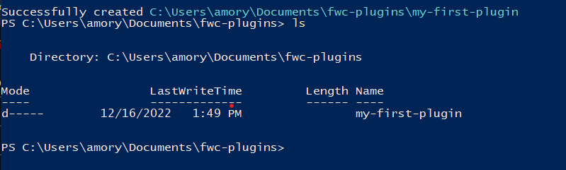
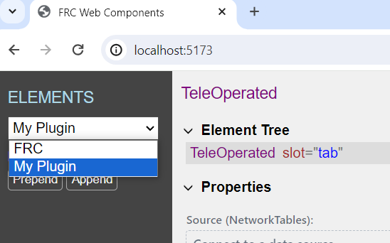
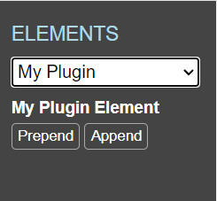

Plugin Development
==================

FRC Web Components (FWC) can be extended through its plugin system. Plugins are created by making an ES module which exports a function that takes in the dashboard instance as a parameter:

.. code:: javascript

  import { FrcDashboard } from '@frc-web-components/frc-web-components';

  export default function addPlugin(dashboard: FrcDashboard) {
    // Plugin code goes here
  }

FWC provides a cli tool which generates a sample plugin that can be used to help get you started with writing your own plugin:

.. code:: bash
  
  $ npm init @frc-web-components/plugin <name>

Note: You'll need `node` installed to run the above command: https://nodejs.org/en/download/

Creating your first plugin
==========================

To get started, open a terminal and enter in the following command:

.. code:: bash
  
  $ npm init @frc-web-components/plugin my-first-plugin

After being prompted with a few questions to help setup your plugin, the plugin project will be created and installed:

.. image:: ./images/creating-plugin.png

Once installed, a new folder should have been created named after the value you passed into the CLI tool:

To launch the plugin, navigate to the plugin root and run the `npm start` command:

.. code:: bash
  
  $ cd ./my-first-plugin
  $ npm start

You should see something like this in your terminal:

.. image:: ./images/start-plugin.png

If the plugin does not launch automatically, copy the URL and paste it into a browser. You should see a web page that looks like this:

.. image:: ./images/plugin-launched.png

From here you'll be able to test the functionality of your plugin in a browser instance of the FWC Dashboard. By default the plugin CLI tool includes an example component called **My Counter** you can use to get started. The components you create for your plugin can be tested by adding them to the dashboard layout. Elements can be added by dragging them into the layout or clicking the **Prepend** and **Append** buttons:

.. image:: ./images/plugin-dnd-test.gif
  :width: 750

Let's open the plugin source code to see what's inside. Visual Studio Code is recommended, but you are free to use any editor you wish:

.. image:: ./images/plugin-source-code.png

The root of your plugin source code is in the **plugin.ts** file. It exports a function which the FWC Dashboard app calls when it starts up. The **addPlugin** function is passed in the dashboard API which can be used to extend the dashboard's functionality. The most common way of extending the dashboard is by adding custom components. You can do this using the **dashboard.addElements** method. Let's look a little closer at the code above:

.. code:: javascript

  dashboard.addElements({
    'my-counter': {
      dashboard: {
        displayName: 'My Counter',
      },
      properties: {
        count: { type: 'Number', reflect: true }
      }
    },
  }, 'My Elements');

The above adds a new component to the FWC Dashboard interface. Note that the above is just a config for the **my-counter** HTML element and not the code for the **my-counter** element itself. The above configuration is required by the dashboard so it knows things like how to add the component to the interface, and information about its properties so they can be controlled using external sources such as NetworkTables.

Some config fields are used for display purposes only, such as the **displayName** field and the second argument in the **.addElements** method which is used by the dashboard app to group similar components together. Update the plugin code to the following and see how it appears in the dashboard:

.. code:: javascript

  dashboard.addElements({
    'my-counter': {
      dashboard: {
        displayName: 'My First Element',
      },
      properties: {
        count: { type: 'Number', reflect: true }
      }
    },
  }, 'My Plugin');

The browser should automatically refresh with the latest changes on save. In the dropdown on the top left, you should now see the **My Plugin** option:

Select this group and you should see the **my-counter** element with the new display name:

Now let's take a look at the code for the **my-counter** component.

Creating custom elements
========================

The source code for the **my-counter** element can be found in the **my-counter.ts** file under the **src** folder of your plugin:

.. code:: javascript

  import { html, css, LitElement } from "lit";
  import { customElement, property } from "lit/decorators.js";
  import getAssetUrl from "./get-asset-url";

  @customElement("my-counter")
  export class MyCounter extends LitElement {
    static styles = css`
      :host {
        display: inline-block;
        width: 200px;
        height: 50px;
      }

      button {
        border: 3px solid black;
        background: white;
        width: 100%;
        height: 100%;
        background-size: cover;
        background-position: center;
      }

      button div {
        padding: 10px;
        background: white;
        display: inline-block;
      }
    `;

    /**
    * The number of times the button has been clicked.
    */
    @property({ type: Number, reflect: true })
    count = 0;

    private onClick() {
      this.count++;
    }

    render() {
      return html`
        <button
          @click=${this.onClick}
          part="button"
          style='background-image: url("${getAssetUrl("button-background.jpg")}")'
        >
          count is ${this.count}
        </button>
      `;
    }
  }

Element Config
==============

For elements to be added and handled by the FWC Dashboard, they need an associated **ElementConfig**. Below are the configuration options needed to define an **ElementConfig**:

Selectors
---------

Each **ElementConfig** added to the FWC Dashboard requires a **selector** so the dashboard interface knows which config should be applied to elements added to the dashboard:

.. code:: javascript

  dashboard.addElements({
    [selector: string]: ElementConfig
  });

A **selector** is any valid CSS selector. Most of the time these are the element tag names, but they can also be more specific, such selectors that match elements with classes and attributes. For example take the following HTML and element configs added to the dashboard:

.. code:: html

  <button>Click me</button>
  <frc-gyro></frc-gyro>
  <input type="text" />
  <input type="checkbox" />
  

    <input type="checkbox" />
    <input type="checkbox" />
  

  

In the above script tag there are 5 element configs added to the dashboard each with a different selector. The *<button>* and *<frc-gyro>* elements will match the *"button"* and *"frc-gyro"* element configs.

To create separate configs for the checkbox and text input elements, configs with attribute selectors *"input[type=text]"* and *"input[type=checkbox]"* are needed.

Also note that when an element matches multiple configs, the one with the highest specificity wins. The checkbox inputs in the div element match both the *"input[type=checkbox]"* and *".checkbox-group input[type=checkbox]"*. Since the second is more specific, the elements will take on those configs.

You can read more on CSS selectors here: https://web.dev/learn/css/selectors/

