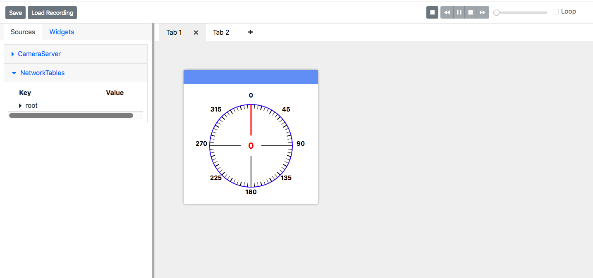
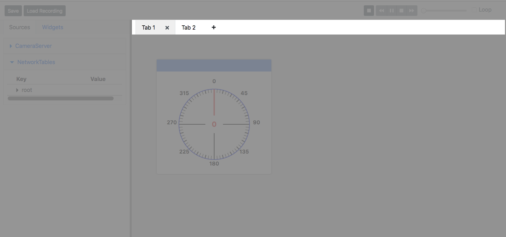

Tour of shuffleboard2js
=======================

Widgets
-------

shuffleboard2js displays data from the robot through widgets. Widgets can take data from sources such as NetworkTables, and display it in a visually appealing way. Examples include a gyro widget which shows the current heading of the robot, and a graph widget which displays the value of a sensor over time.

Widget area
-----------

.. image:: images/widget-area.png

This is the area where you place your widgets. Multiple widget areas can be created by adding tabs. Widgets added to the widget area can be removed, moved, and resized.

Widget Tabs
-----------

Multiple widget areas can be created by adding tabs. Widgets tabs can be added, removed and renamed.

Widget menu
-----------

.. image:: images/widget-menu.png

Widgets can be added to the dashboard by dragging and dropping them from the widget menu to the widget area. The widget menu is organized into categories.

Sources area
------------

.. image:: images/sources-area.png

The sources area contains data sources that can be dragged and dropped onto widgets in the widget area.

Record/playback controls
-------------------------

.. image:: images/record-playback.png

All NetworkTable updates can be recorded and replayed later for debugging purposes.
