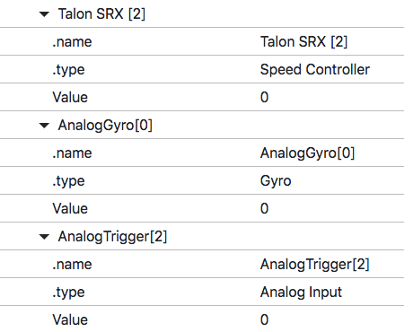
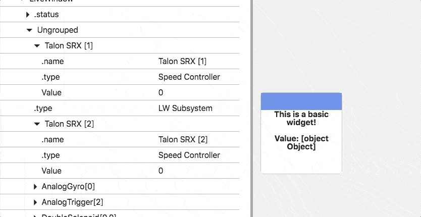
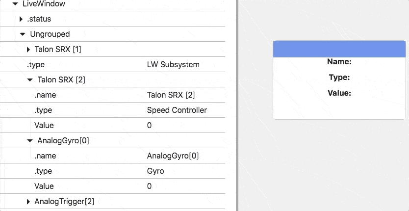

.. _widget-anatomy:

Widget Anatomy
==============

RiotJS
------

*shuffleboard2js* allows you to build custom tags using the `RiotJS <https://riot.js.org/>`_ library. To start learning about how you can create your own custom widgets it's recommended you read RiotJS's guide `here <https://riot.js.org/guide/>`_.

Styling your widget
-------------------

To style your widget add a ```` tag:

.. code:: html

  <your-widget-id>

    <!-- Widget HTML goes here -->

    

  </your-widget-id>

Adding a 
--------------------------

Scripts can be added to your tag by adding a ```` tag:

.. code:: html

  <your-widget-id>

    <!-- Widget HTML goes here -->

    

  </your-widget-id>

Linking to files in your widget folder
--------------------------------------

If you have files in your widget folder you want to use, the link to these files must be in the following format: ``/widgets/[YOUR WIDGET ID]/[FILENAME]``. For example, if you want to display an image with filename *image.jpg* in a widget with ID *your-widget-id*, you could write the following code:

.. code:: html

    <your-widget-id>
      
    </your-widget-id>

Setting accepted types when registering your widget
---------------------------------------------------

The value of the *acceptedTypes* configuration property passed into the *dashboard.registerWidget* function determines what NetworkTables sources can be dragged onto the widget.

.. code:: html

  dashboard.registerWidget('widget-id', {
    acceptedTypes: ['string'],
    ...
    ...
    ...
  });

In the code above the *acceptedTypes* property is passed an array with the element *'string'*. This means that only NetworkTables keys with value type *string* can be dragged onto the widget.

There are two kinds of widget types that can be passed into the *acceptedTypes* property: The primitive NetworkTable types that each individual NetworkTable key has, and types determined by keys that end in *.type*.

This is the list of primitive types *acceptedTypes* can be passed:

- string
- number
- boolean
- array

Here are some examples of types of the *.type* kind:

- Speed Controller
- Gyro
- Analog Input
- Digital Input
- Double Solenoid

Getting NetworkTables data in your widget code
----------------------------------------------

NetworkTables data is accessible from your widget code through ``opts.table``:

.. code:: html

   <your-widget-id>
     
NetworkTables data: {opts.table}

     
   </your-widget-id>

For example, the ``basic-widget`` we created in the last section, which accepts NetworkTable values of type *string*, will show whatever NetworkTables value of type *string* is dragged onto the widget:

If the widget's accepted types that are determined by the *.type* key, then ``opts.table`` will be an object containing all the keys in the subtable dragged onto the widget. For example, take the following widget that accepts types *Gyro* and *Speed Controller*:

.. code:: html

    <basic-widget>
      
Name: {opts.table['.name']}

      
Type: {opts.table['.type']}

      
Value: {opts.table['Value']}

    </basic-widget>

Setting NetworkTables values from your widget
---------------------------------------------

To set NetworkTables values use the function ``NetworkTables.putValue`` (You can read more about how this function works here: https://pynetworktables2js.readthedocs.io/en/stable/api_js.html#NetworkTables.putValue)

If you need to set the value of the NetworkTables key dragged into the widget, you can get the key from ``this.opts.ntRoot``:

.. code:: html

    

If the key passed into is not a primitive but a subtable instead, you can get the key from ``this.opts.ntRoot + 'key relative to ntRoot'``:

.. code:: html

    

Updating the widget
-------------------

Widgets are updated automatically when any NetworkTables values change. To update manually call ``this.update()``.

.. code:: html

  <your-widget-id>

    <!-- Widget HTML goes here -->

    

  </your-widget-id>

Adding properties
-----------------

**Getting properties**

**On properties update**

If you want to receive updates when the widget's properties are updated, use the ``propertiesUpdate`` event:

.. code:: html

  <your-widget-id>

    <!-- Widget HTML goes here -->

    

  </your-widget-id>

**Properties modal**

Other Events
------------

If you want to receive updates when the widget is resized, use the ``resize`` event:

.. code:: html

  <your-widget-id>

    <!-- Widget HTML goes here -->

    

  </your-widget-id>