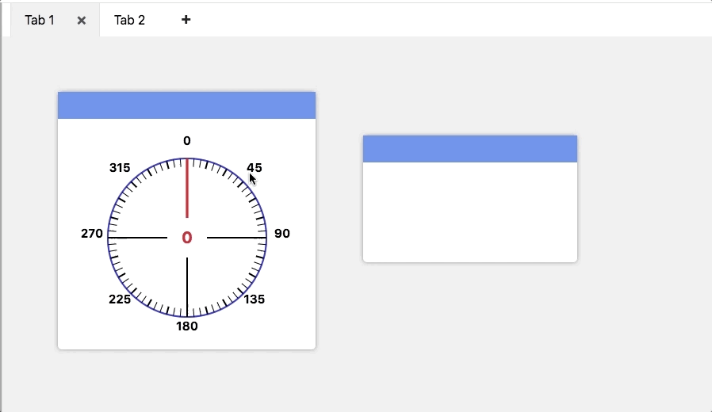
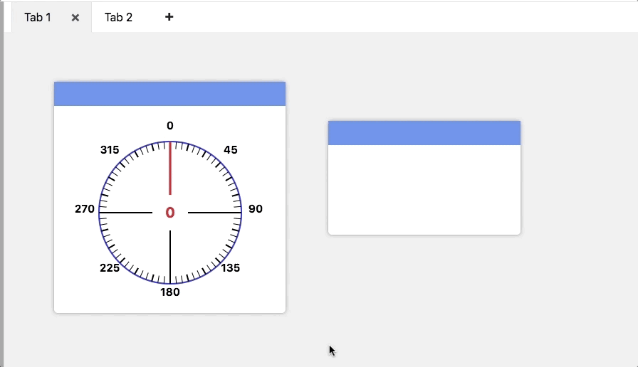
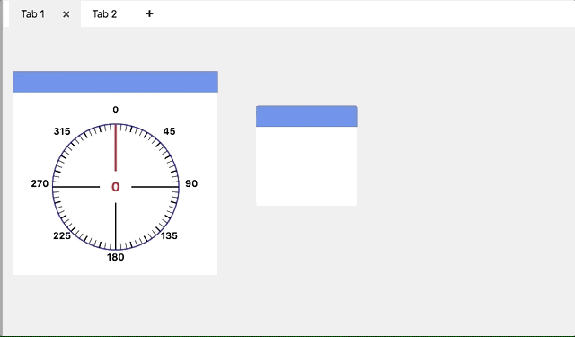
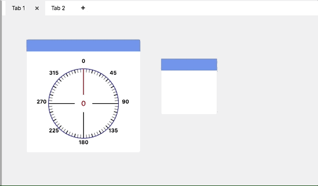

Working with Widgets
====================

The widget area is where you place your widgets. Widgets added to the widget area can be removed, moved, and resized.

Removing widgets
----------------

Individual widgets can be removed by right clicking their headers (the blue background at the top) and clicking *Remove* in the context menu.

All widgets can be removed by right clicking the widget area and clicking **Clear** in the context menu.

Moving widgets
--------------

Widgets can be moved by left clicking and dragging the top of the widget to another location in the widget area. When placing widgets on the widget area, they'll snap to the grid. If another widget is in the location of the widget being placed, it will move to another location to make room.

Resizing widgets
----------------

Widgets can be resized by left clicking and dragging the bottom right corner of the widget. If another widget is in the location of a scaled up widget, it will move to another location to make room. Widgets can not be made smaller than their minimum size.