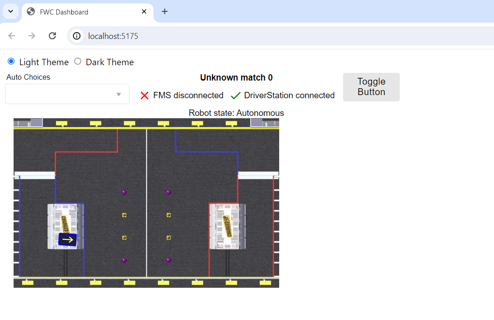

# FWC custom dashboard with React + TypeScript + Vite

This template should help get you started developing a custom FWC dashboard with React + Typescript + Vite.

[<- Home](/README.md)

-   [Generating custom dashboard](#generating-custom-dashboard)
-   [Installing](#installing)
-   [Running](#running)
-   [Connecting to Robot](#connecting-to-robot)
-   [Connecting elements to NetworkTables with useEntry hook](#connecting-elements-to-networktables-with-useentry-hook)
-   [Connecting elements to NetworkTables using `source` attributes](#connecting-elements-to-networktables-using-source-attributes)
-   [Component documentation](#component-documentation)
-   [Theming](#theming)

## Generating custom dashboard

FWC provides a cli tool which generates a sample custom dashboard that can be used to help get you started with writing your own:

```bash
npm init fwc@latest <name>
```

Note: You'll need <span class="title-ref">node</span> installed to run
the above command: <https://nodejs.org/en/download/>

To get started, open a terminal and enter in the following command:

```bash
npm init fwc@latest my-custom-dashboard
```

After being prompted with a few questions to help you get setup, the project will be created and installed. The cli tool provides templates to create custom dashboards using [react](https://react.dev/) or [svelte](https://svelte.dev/):


## Installing

To install run the following command:

```bash
npm install
```

## Running

To run the dashboard in dev mode cd into the directory that was created in the last step and run the following command:

```bash
npm run dev
```

You should see the following in the terminal:


The dashboard should launch automatically in the browser. If not, open it manually using link shown in the terminal. (http://localhost:5173 for me)

You should see the dashboard in the browser:



## Connecting to Robot

The address the dashboard connects to can be changed by updating the `address` attribute of the `NT4Provider` in the `src/main.tsx` file:

```typescript
<NT4Provider address="localhost">
  <App />
</NT4Provider>
```

Use `localhost` for simulation and your team number/IP address when connecting to your robot. For example if your team number is `1234` you would set address to `1234` or `10.12.34.2`.

## Connecting elements to NetworkTables with useEntry hook

One method of connecting HTML and svelte elements to NetworkTables is through the `useEntry` react hook in the `@frc-web-components/react` package:

```typescript
import { useEntry } from "@frc-web-components/react";

const [pose] = useEntry("/SmartDashboard/Field/Robot", [0, 0, 0]);
```

`useEntry` is similar to `useState` but sends and receives updates to a NetworkTables topic instead. The first parameter is the topic name and the second parameter is the default value. The above line will subscribe to the `/SmartDashboard/Field/Robot` topic. You can pass in the value returned to your element attributes/props. For example:

```html
<FieldRobot pose="{pose}" />
```

The pose prop will be set to the current value of `pose` and will be updated whenever the topic changes.

To send updates `useEntry` returns a setter function as well. For example:

```typescript
const [count, setCount] = useEntry("/dashboard/count", 0);
setCount(5);
```

The above will update the `/dashboard/count` topic with the value `5`.

## Connecting elements to NetworkTables using `source` attributes

Elements shipped with FWC are able to be connected to NetworkTables by giving them a `source-key` attribute with a topic to subscribe to. For example:

```html
<SendableChooser source-key="/Shuffleboard/Autonomous/SendableChooser[0]" />
<BasicFmsInfo source-key="/FMSInfo" />
```

This option is often far easier than connecting each element manually through their props/attributes using the useEntry hook. For example, to connect the Basic FMS Info component manually you would need to do this:

```typescript
const [matchType] = useEntry(`/FMSInfo/MatchType`, 0);
const [matchNumber] = useEntry(`/FMSInfo/MatchNumber`, 0);
const [eventName] = useEntry(`/FMSInfo/EventName`, "");
const [fmsControlData] = useEntry(`/FMSInfo/FMSControlData`, 0);

return (
  <BasicFmsInfo
    matchType={matchType}
    matchNumber={matchNumber}
    eventName={eventName}
    fmsControlData={fmsControlData}
  />
);
```

That's a lot more code! Because of this using the `source` attribute approach is great for some components such as `Basic FMS Info` and `Sendable Chooser` where a lot of topics published into NetworkTables need to mapped to the componenent attributes/props.

> [!TIP]
> Using both methods of connecting elements can be used at the same time. For example: `<Gyro source-key="/gyro/angle" precision={precision} />`. If the `/gyro/angle` topic is a number then that topic will be mapped to the `value` attribute on the `<Gyro />` element and precision will be connected to whatever topic the `precision` store is assigned.

## Component documentation

Documentation on the FWC component library can be found here: https://frc-web-components.github.io/storybook. It contains information on how to import components and usage examples.

For example to import the [field](https://frc-web-components.github.io/storybook/?path=/docs/frc-field--docs) component:


Each component also has examples with form fields you can use to play around with the component and generate html you can copy into your code:


> [!WARNING]
> The storybook examples generate html which can be used in `lit` and `svelte` dashboards. You'll need to convert the html to the React version. The props can be converted by changing them to camelCase. For example `some-prop="10"` should be changed to `someProp={10}`.


## Theming

The recommended way to do theming is using [CSS variables](https://developer.mozilla.org/en-US/docs/Web/CSS/Using_CSS_custom_properties).

As an example suppose we want to back the `button` text color in the `MyElement` component in the `src/components` folder black. We could do this with the following css rule:

```css
color: black;
```

To make this rule themable change it to the following:

```css
color: var(--my-element-color, black);
```

`--my-element-color` is the CSS variable. CSS variables are prefixed with `--`. To ensure uniqueness and to prevent accidentally overwriting existing rules prepend your variable with the element name. `black` is the default value if a theme is not set.

Per theme rules can be added by modifying the `themes.ts` file located in the `src` folder:

```typescript
export const customLightTheme = {
  "--my-element-background": "cornflowerblue",
  "--my-element-color": "white",
};

export const customDarkTheme = {
  "--my-element-background": "cadetblue",
  "--my-element-color": "black",
};
```